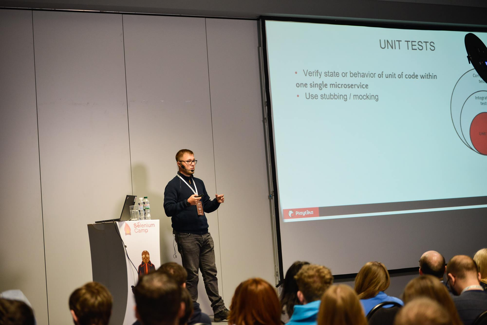

Hi there! My name is Oleksandr Romanov. I am Software Engineer in Test / Software Engineer from Dnipro, Ukraine.

With over 14+ years of experience in testing and test automation, I have honed my skills in building and leading test automation processes. My work has spanned across various industries, including banking apps, payment services, CMS systems, and mobile games.

Now, I am responsible for building and testing complex blockchain and blockchain-based applications.

For detailed work experience - refer to my [CV](https://docs.google.com/document/d/e/2PACX-1vTbHDlOtD7pCFNlM4R-cjLY-mkxiFxh6XJ1wv_ewT8a-wlJ_gmhCueuLajVextzXdNIVZ-BnuKBCJdB/pub)

## What do I do

I love to share my knowledge in many forms:

- I do [public talks on testing](#my-talks)
- I am a co-host of ["Testing Minutes" podcast](https://youtu.be/jcbc1YOSHT8?si=d7siLc83FfrfGcNS) and occasional host at ["This Week in Quality" by Ministry of Testing](https://www.ministryoftesting.com/podcasts/this-week-in-testing)
- I write articles: [XRay](https://www.getxray.app/blog/testability-in-the-software-development-lifecycle), [Ministry of Testing](https://www.ministryoftesting.com/articles/software-testing-careers-many-paths-to-success)
- I collect useful materials on [blockchain testing](https://github.com/alexromanov/awesome-blockchain-testing)
- I do [mentoring, consulting and technical interview services](https://www.linkedin.com/in/oleksandr-romanov/details/recommendations/?detailScreenTabIndex=0)

## My Talks

| Talk | Event | Year |
| -----| ----- | ---- |
| How to find time and focus to learn everything everywhere all at once | Tech Talks at [Sage](https://www.linkedin.com/company/sage-software/), Online | 2026 |
| [Software Testing Careers: The Roadmap](https://www.ministryoftesting.com/talks/software-testing-careers-the-roadmap-by-oleksandr-romanov-for-mot-tunis) | Ministry of Testing, Tunis, Online | 2025 |
| Як обрати школу тестування | QADay, Ukraine, Online | 2025 |
| Кар'єрний шлях спеціаліста з тестування | National Technical University of Ukraine, Online | 2023 |
| How to test a blockchain? | Colombo Quality Week, Sri Lanka | 2023 |
| [Що значить тестувати блокчейн](https://youtu.be/lGjqihPPvRE?si=1vClwn8qRemRkvTS) | QA Party Hard, Ukraine | 2023 |
| [What does it mean to test a blockchain?](https://youtu.be/LLF45RHA3AM) | SoftServe QM Week, Online | 2022 | 
| [High Tech-Low Test or Problems of Modern Testing](https://youtu.be/jigPyy6wSfk) | Ministry of Testing Abu Dhabi, Online | 2022 |
| [Practical Contract Testing with Spring Cloud Contract](https://youtu.be/GqN8OoODMOI) | Ministry of Testing Abu Dhabi, Online | 2020 |
| [Practical Contract Testing With Spring Cloud Contract](https://youtu.be/23r9_w3lJfY) | TAQELAH Singapore, Online | 2020 |
| [Ups and downs of contract testing in real life](https://youtu.be/kAZYAs8Mta4) | Selenium Camp, Ukraine | 2020 |
| [Practical Contract Testing with Spring Cloud Contract](https://youtu.be/_AYfxXJ7o20) | TestCon Europe, Lithuania | 2019 |
| [Turning automation education upside-down](https://youtu.be/_AYfxXJ7o20) | QA Fest, Ukraine | 2019 |
| [Testing challenges at microservices world](https://youtu.be/WDHmmdxYIDs) | Test Fest, Poland | 2019 |
| [Integration testing for microservices with Spring Boot](https://youtu.be/PYb_cqU6TD8) | Selenium Camp, Ukraine | 2018 |
| Hidden complexities in microservices testing | ITEM conference, Ukraine | 2018 |
| Automating microservices: what, where and when | IT Weekend, Ukraine | 2018 |
| Testing for Java Developers | IT Weekend, Ukraine | 2017 |
| The One where Cucumber meets Scala | IT Weekend, Ukraine | 2017 |

## My areas of interest

Test engineering, distributed systems, blockchain, cryptography, learning, developer productivity, technical education and mentoring

## Skills & Technologies

- Programming languages: Rust, Python, Bash, Java;
- Performance testing: k6, JMeter, Grafana, InfluxDB
- Test Automation: pytest, Selenium WebDriver, Appium, JUnit, Scalatest, Selenium Grid, Selenoid;
- CICD: GitHub CI, Jenkins, GitLab CI, Buildkite;
- Frameworks: Substrate, Spring Boot, Spring Cloud Contract, Cucumber, Serenity, Gauge;
- Dev Tools: Claude Code, PostgreSQL, Apache Kafka, MariaDB, Aerospike, Grafana, Kibana; Docker, AWS (S3, EC2);

## Contributions

- [Awesome Blockchain Testing](https://github.com/alexromanov/awesome-blockchain-testing)
- [Visual Regression Tracker](https://github.com/Visual-Regression-Tracker/sdk-java)
- [test-containers-spring-boot](https://github.com/Playtika/testcontainers-spring-boot)