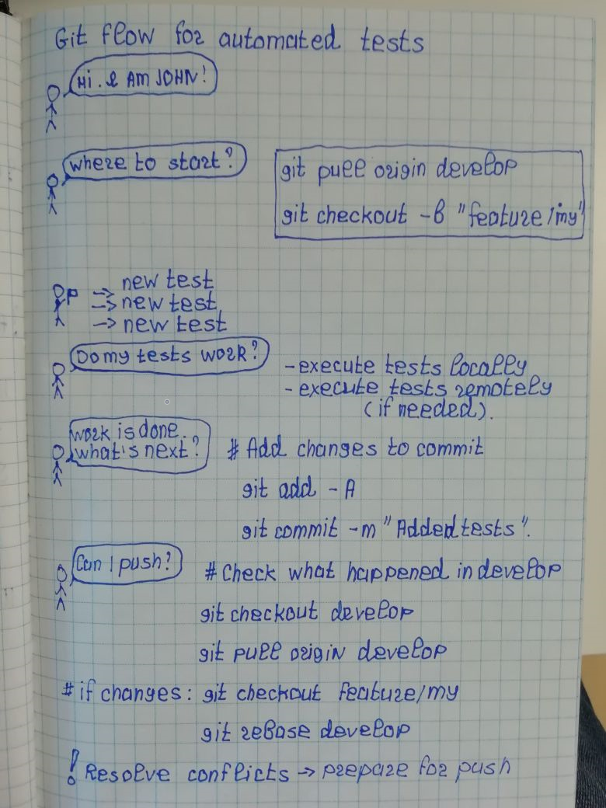
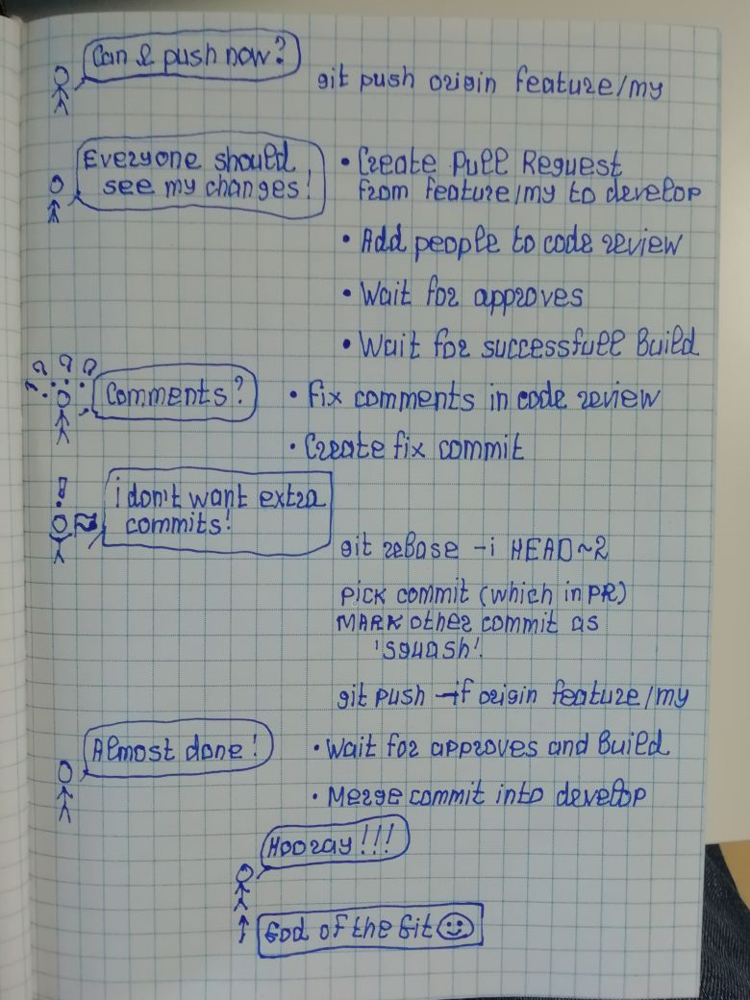

## Explaining git flow for new test automation engineers

Instead of adding a big cumbersome description of the git flow at the Confluence, I personally start to explain concepts visually.

That's why I want to share a couple of visual representations of the Git Flow (which we are currently use for implementing automated tests).

I hope it will be useful for people, who just started with Git and automation.

**This flow is not related only to automated tests - it is applicable to any development change in the project.**

**Pay attention, that the way of creating of Pull Requests require different steps based on the solution you use (BitBucket, Github, etc.)**
