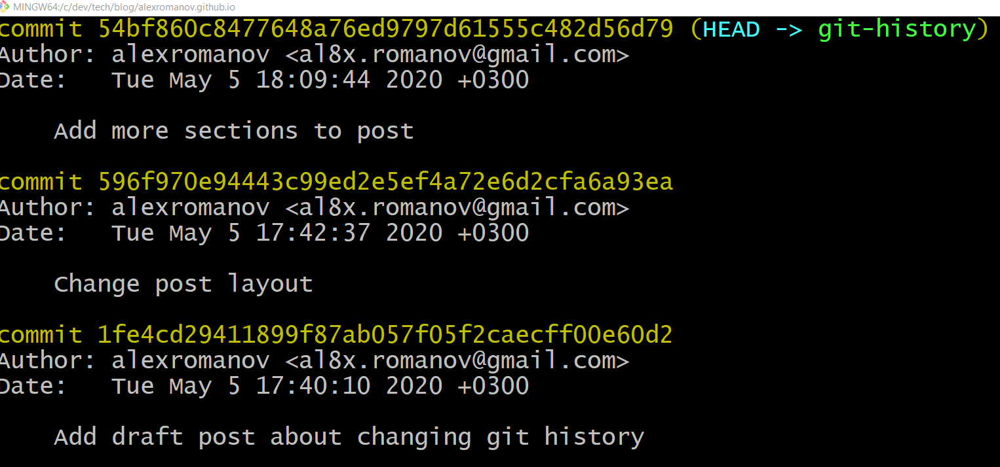
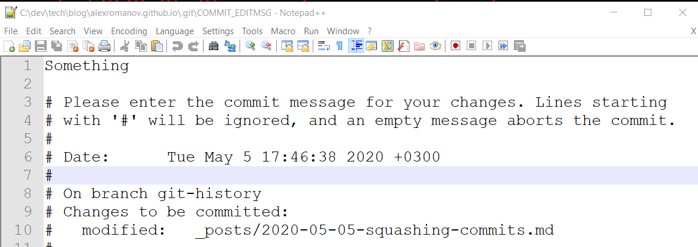
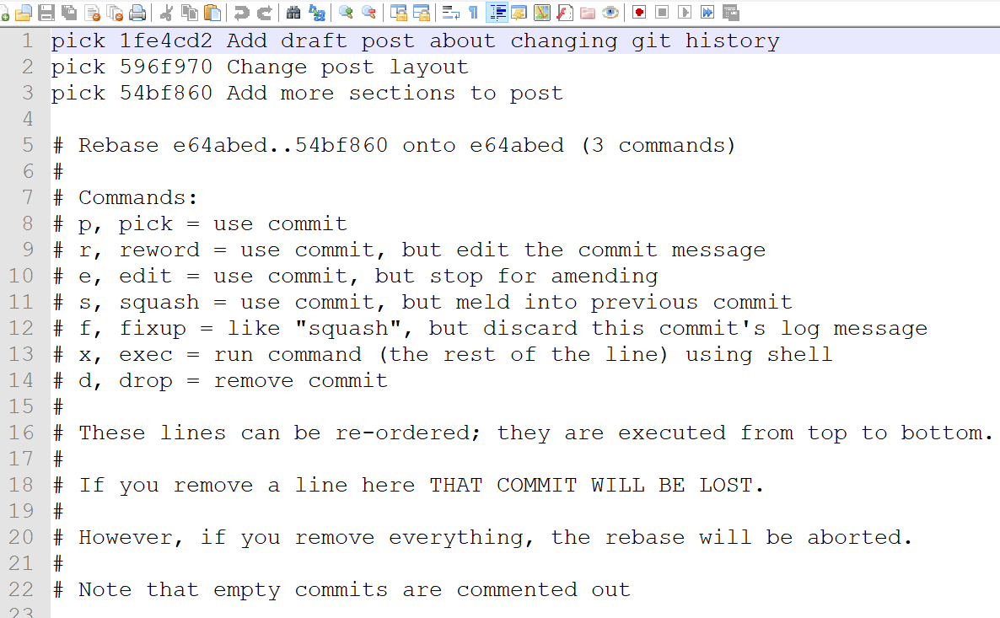
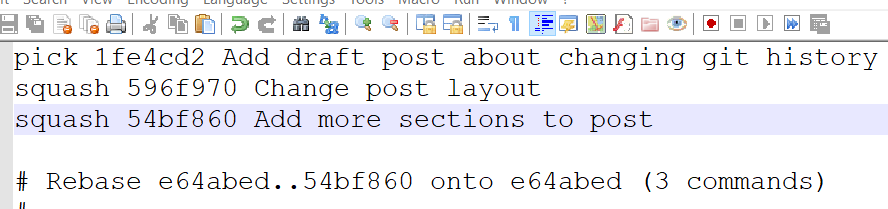
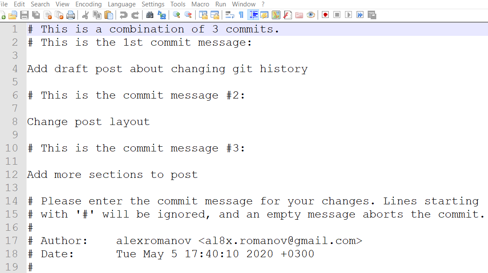
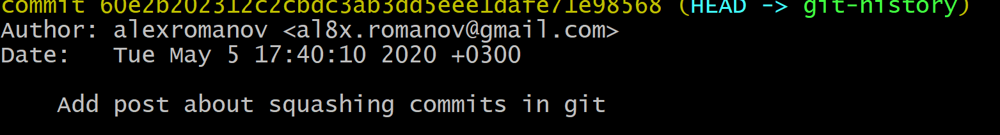

## Bad things happen

GIT is a version control system which one of the most widespread among developers around the world.

While using it day by day, bad things can happen:

- you can commit something not useful (by accident)

- you may want to change commit name (due to mistake)

You may also want to keep commit history clean instead of filling up with a bunch of redundant information, like this:



## Changing commit if it hasn't been pushed to the remote

In case if there is only one commit made and it has not been pushed to a remote repository - it is possible to modify multiple things for a given commit:

- Change commit message:

  ```console
  git commit --amend
  ```

After executing the command, you should manually edit the commit message:



- Revert last commit (number after ~ states number of commits to get back):

  ```console
  git reset --soft HEAD~1
  ```

## Turn multiple commits at one

Making multiple commits as one called squashing.

Here is how to do it via the command line:

1. First of all, you need to have either default text editor installed on working machine or install a new one.

   It can be for example Notepad++, Sublime Text, vim, etc. Before changing the history, we need to tell Git, which editor to use (for example Notepad++):

   ```console
   git config core.editor "'C:\Program Files (x86)\Notepad++\notepad++.exe' -multiInst -notabbar -nosession -noPlugin"
   ```

2. Start the squashing process by executing an interactive rebase process in a working branch:

   ```console
   git rebase -i HEAD~3
   ```

3. After executing the command, Git will open a text editor and offer you to perform actions on a given number of commits.

   

   You can either check commit as 'pick' or 'squash'.
   In case of marking commit as 'squash' it will be included into one which marked as 'pick'.

   In the end, it is better to leave one commit as 'pick' and mark others as 'squash'.

   

4. The next step is to modify commit message after squashing. You can use the same text editor.

   

5. In the end, instead of three commits, in Git history will be displayed only one.
   

## Conclusion

There is no need to worry if something wrong included in the commit or too many commits have been added. Git lets you change history in many ways.

Do you often change your commit history?
