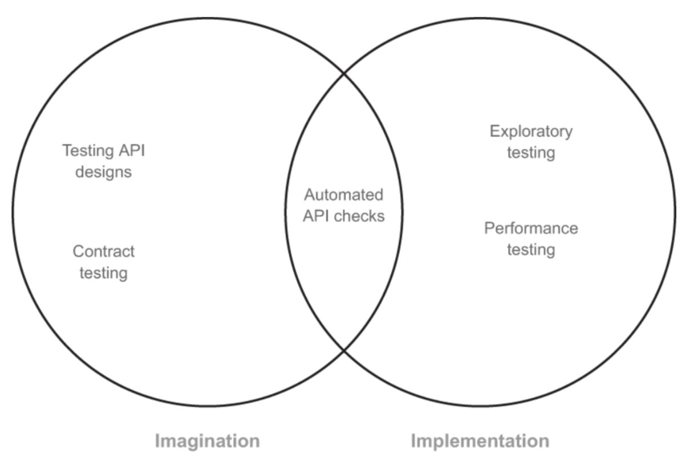

## What is API testing, and what is not

There are dozens of books on APIs on the market. There are hundreds, if not thousands, of online and offline courses that teach you how to do API testing.

Most of the books and courses I found (and learn from) concentrate solely on the technical side of the story: how APIs work, how to use a specific tool for a specific kind of testing.

When you are a beginner in testing, your job is to learn how to operate the tools. You don't have time to ask why you work like that. You don't have time to stop and think through alternatives.

API Testing means HTTP REST. HTTP REST probably means GET and POST methods, along with some form of authorization. Grab a testing tool like Postman or Insomnia and rush into creating request-response-like tests for each endpoint you encounter in the application.

But API testing is not only about tools or automation libraries. API testing (like any other testing activity) requires a mindset and a proper approach.

So, to read about this approach, you should check the book **["Testing Web APIs"](https://a.co/d/00Qnf040) by Mark Winteringham.**

Well, you may ask me, Oleksandr, what's inside a book, and do I need to read it? Let me share my impressions of the book.

## My insights from Testing Web APIs

### Mental model of API testing

Mark starts the story with a key question: what is the value of testing in general, and how to be strategic with API testing in particular.

As he mentions:

> ... goal of testing is to understand and learn about what we want our products to do and how they should work

I really love that Mark has adapted [James Lyndsay's testing model](https://www.workroom-productions.com/why-exploration-has-a-place-in-any-strategy/). Testing can be split into two big piles: imagination and implementation.

The goal of testing is to test both parts. And what's more interesting, we, as testers, should verify APIs on the imagination and implementation sides.

You may say: "That's a huge amount of testing!". How can a single test engineer do all of it? Mark will tell you how in each chapter of the book.

> P.S. By the way, that's a clear indication of the market requirements of the modern quality engineers. Now we need to think holistically about testing and adapt more than a single tool to poke an API endpoints.

### Make a cocktail before testing

Test strategy is not only a piece of paper (or a Confluence page). It reflects our understanding of the system, its context, and more than that, our understanding of concepts of quality.
To set any quality goals, as Mark says, we need to research quality characteristics and map our users as precisely as possible.

The next step is to add risks to this cocktail, mix it well, and do not stir. How to do it? Mark offers a few techniques, such as Headline game or Risk Storming. Both are extremely practical and useful.

Those are the ingredients of a test strategy. And that should be a first step before taking a tool out of a holster.
Unexpected ways to test APIs

As I mentioned in the beginning, there are a lot of tutorials on how to use the tool for API testing.
But what about you who don't have an implemented API yet? Can you test it? Mark's answer is - 100% yes.

In the book, he offers a really nice tools for questioning API designs. Starting with the well-known "Five Whys and How" technique, he delves deeper into other techniques and methods.

More than that. I was amazed that we can also do ... exploratory testing for our APIs! Mark explains how to do it effectively and how to use different chapter variants, such as those created by Elizabeth Hendrikson or Dan Ashby.

### Illusions and the value of automation

Another insight that I got from "Testing Web APIs" was the chapter about automated testing of APIs.
In the book, Mark mentions the illusion of automation. Automation requires skills and investment. This investment is not only upfront - we need to spend time to maintain automated tests.

The main takeaway is:

> Automation will tell us only what we asked it to tell us and nothing more.

In my opinion, that's what should be taught in the first lectures of any automated testing course.

> P.S. Performance and security testing chapters are good and well-structured as well

## Conclusion

The main question that you, dear reader, may still have is - "Do I need to buy and read this book?"

The short answer is - yes. The book's content ages well, and many of the approaches will be applicable for a long time. (Longer than the time between releases of new versions of AI tools).

"Testing Web APIs" will be useful when you are a junior. But as a senior tester, you also may find ideas and techniques to use in your current work.

This book is full of insights, and it's not a step-by-step tutorial that will change next week.

> P.S. Model of testing (imagination vs implementation) can be used more widely than just for APIs