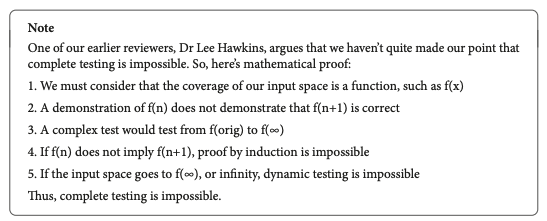
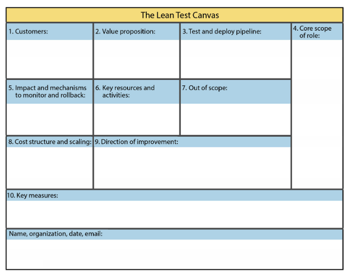
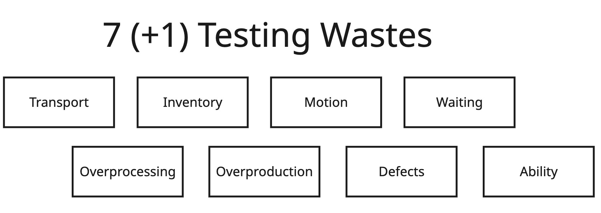

## On books about testing

I am always curious about new things and technologies in software testing. But another category of books is the ones that are not just about theory. These books are full of practical knowledge. These books are full of the authors' opinions, their own vision of how things work.

So, once upon a time, I started to look for a modern book on software testing. More than that, I started looking for a book that does not have "Foundation" in its title. I already read "How Google Tests Software" and a few other books. 

But then I found ["Software Testing Strategies: A Testing Guide for the 2020s"](https://a.co/d/0b1MrJ1V) written by **Matthew Heusser** and **Michael Larsen**. It was new and had many 5-star reviews on Amazon. I also discovered that this book covers a variety of topics and strategies: from designing tests to managing test data, to creating test strategies, the philosophy, and the ethics of testing.

I decided that the book is definitely worth my attention. And ... I was right about it!

Let me share a few insights from reading "Software Testing Strategies: A Testing Guide for the 2020s" book.

## 5 insights from Software Testing Strategies

### 1. Proof of the impossibility of complete testing

When I first started learning about software testing, I learned about fundamental testing principles. You can find them at the [ISTQB foundation level syllabus](https://istqb.org/wp-content/uploads/2024/11/ISTQB_CTFL_Syllabus_v4.0.1.pdf).

One of the principles is "Exhaustive testing is impossible". It seems kinda obvious, but I always wondered why it's impossible?

The authors of the [Software Testing Strategies](https://a.co/d/0b1MrJ1V) book ... provide a mathematical proof that complete testing is impossible. 

> So now, if someone is asking you about the proof, you can share this one. 

### 2. Automated testing is full of problems

While many book and blog authors praise automation as the one and only answer to improving any testing process, Matthew Heusser and Michael Larsen state that automation is, in fact, not a silver bullet. Automation is full of potential problems, and we, as experienced testers, need to be aware of them (and share with the team)

What kind of problems? Here are a few of them:
1. Minefield regression problem - automated tests do not offer much randomization.
2. Battleships problem - automation rarely beats human intuition
3. Maintenance problem - automated test maintenance can't keep up

There are more problems in the book - explore it!

> By the way, it is interesting to read through the book now, when AI tools get more and more 'intelligent'. Can AI solve any of these problems? Or can it make it even worse? How do these problems apply to the testing of AI-based solutions and algorithms? Maybe it's time to get a new version of the book?

### 3. Humans test differently from machines

> "The test of first-rate intelligence is the ability to hold two opposing ideas in mind at the same time and still retain the ability to function. One should, for example, be able to see that things are hopeless yet be determined to make them otherwise." (c) F. Scott Fitzgerald.

The reason for putting such a quote was that the authors of the book defined two contradicting statements about UI testing:

- Graphical user interface (GUI) facing test automation is a silly waste of time
- Testing should be automated as an inherent good

I like how Matthew and Michael explain how humans and machines conduct testing. 

Machines do whatever you tell them to do. They will either report any violation as a bug or ignore it altogether. 

Human testers do not have this problem. They will notice anything wrong that has occurred in the system while performing a scenario. 

> It looks like an obvious topic, but I saw a lot of testers who want to automate everything without asking a question of why.

### 4. Lean test canvas and testing

One of the more interesting insights from the book is the usage of the lean test canvas. It's the way testing is defined in the organization. 

The key here is to give each team member this canvas and ask them to fill it out. The answers will vary, but they will be insightful.

Another fascinating thing from the "Software Testing Strategies" book was the explanation of typical wastes (from the Toyota Production System) - but from a testing point of view. 

### 5. Can testers assure quality?

There is a constant debate in the testing community on whether software testers can assure quality. 

Some people say - no. Matthew and Michael say that testers can assure quality. The matter is how we state it. 

When a tester finds a bug and asks someone else to decide whether to fix it, it's not quality assurance. 

But what is "assurance"? Based on the definition of the word, assurance is 

> simply a statement that something is true or will happen (c) M. Heusser and M. Larsen

When a tester finds a bug that is not fixed, it is not a failed assurance. 

What authors mention:

> Most people realize there is a difference between assurance and insurance. Likewise, while the dictionary lists a guarantee as a promise, assurance is missing a key part of a guarantee, which is the remedy for failure to comply. (c) M. Heusser and M. Larsen

How can testers assure quality? Just declare ... that they can't. 

> Being able to say "My role is quality assurance; I don't think that's a quality decision, but it's not mine to make" or writing it in an email could provide career coverage, but more importantly, it could cause someone else to reconsider the decision. Done well, it could materially impact the outcome for the better. So, what is the problem, exactly? (c) M. Heusser and M. Larsen

## Conclusion

What else can you find in the book?

1. A lot of practical examples on how to apply different techniques such as equivalence classes, decision tables and trees, pairwise, and others. E.g., - how to approach testing upgrade in the "Extract-Transform-Load" (ETL) type of systems
2. Each chapter has a "Further Reading" section where those who are curious enough can find a lot of resources on the topics - from books to whitepapers
3. Fun, but clever diagrams to explain serious matters
4. The authors conducted a lot of experiments during their workshops. It was exciting for me to read about those experiments and their results
5. A bunch of information that will make you question your testing beliefs or tools

At the downsides:
- Maybe some of the testers will not enjoy chapters on philosophy, ethics, wording, or testing schools
- Some may find chapters about delivery models or wastes in lean processes not applicable to their job
- Coding geeks may lack more examples of tools or approaches

["Software Testing Strategies: A Testing Guide for the 2020s"](https://a.co/d/0b1MrJ1V) is not an entry-level book. Like [Lessons Learned in Software Testing](https://a.co/d/03U2sWP8) - the main benefit from the book you can get when you have at least a few years of experience. 

The book was full of insights and ideas. It shows new ways to approach obvious problems. 

Should you read it if you want to improve your testing skills and horizons? Yes. 

Should you read it if you want another recipe book for X library or a library of AI prompts? No. 

The choice is up to you. See you next time. 