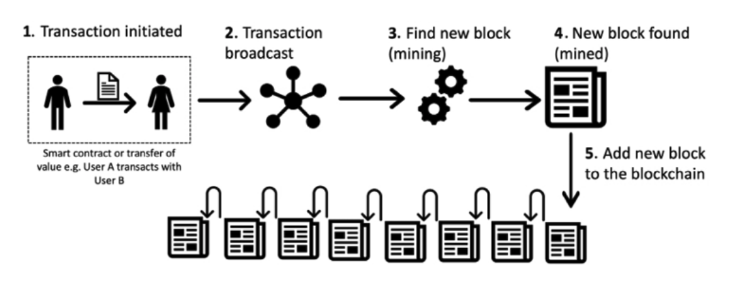
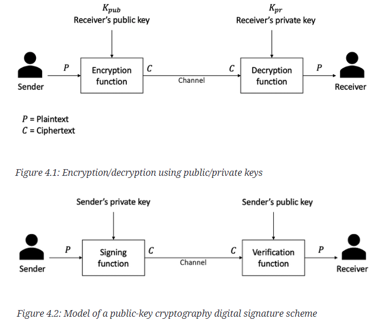
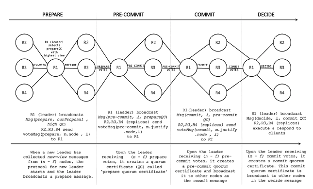
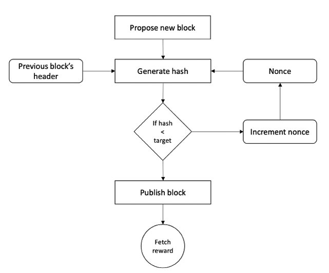
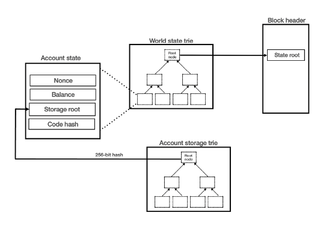
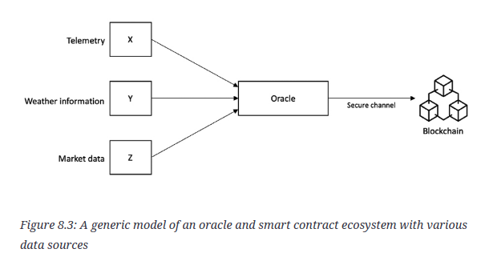

## First steps in the blockchain world

I have been working in blockchain for more than 5 years now. Since I joined the world of blockchain, I have been reading everything I can find on the technical aspects of different blockchains and various fundamental topics.

At first, I read blog posts and watched videos. In 2021, there were many videos explaining what blockchain is. But very few videos show how actually to test blockchain.

Then I found whitepapers. Whitepapers are the most up-to-date yet the most challenging to read. Some papers require background knowledge in computer science and math. But whitepapers can provide a lot of information.

> NOTE: I am collecting everything I found about blockchain testing in the **[awesome-blockchain-testing](https://github.com/alexromanov/awesome-blockchain-testing)** repo. Here you can find videos, books, whitepapers, and tools that help to test blockchain. I have also written a short series of blog posts: **["Blockchain for Test Engineers"](https://testengineeringnotes.com/posts/2022-04-24-blockchain-testing-mindmap/)**. It is a good starting place for your testing journey. 

I also read blockchain books. But there are a bunch of books on the market. Most of them are either poorly written or just another "Ode to Bitcoin" with a marketing aftertaste.

So it's hard to find a good technical book about blockchain. But the one I will talk about today is an exception. ["Mastering Blockchain: Inner workings of blockchain, from cryptography and decentralized identities, to DeFi, NFTs and Web3, 4th Edition"](https://a.co/d/0cvKzxXp) book by Imran Bashir is deeply technical and useful for any engineer starting in blockchain.

Let me share my insights from the book. 

## 5 insights from Mastering Blockchain 

### 1. Technical foundations of the blockchain

In the first chapter of the book, the author talks about the fundamental knowledge we need to understand blockchain. 

Starting with a general description of the blockchain and how it differs from the ordinary websites we all used to, Imran Bashir thoroughly and methodically explains each concept.

What's inside?

- Symmetric cryptography, including cryptography primitives such as hash functions, Merkle trees, and message authentication codes.
- Asymmetric cryptography - with examples like digital signatures, elliptic curves, threshold signatures

For those who want even more, there is information about zero-knowledge proofs (ZK-SNARK and ZK-STARK) and verifiable functions. 

### 2. Overview of the key consensus protocols

Consensus algorithms are among the most important components of how blockchains work. The author starts by describing the properties of such algorithms and basic classification. 

Then, he explains the most widespread consensus algorithms on the "market":
- Paxos and Raft
- BFT algorithms, with an example of Tendermint
- Proof Of Work algorithm and its alternatives (Proof Of Stake, Proof Of Storage, Proof of Activity)

At the end of the chapter, there is a brief description of the latest advancement of the consensus world - a BFT-based algorithm called HotStuff.

My favorite part is not a description of the algorithm (which, in fact, is fascinating). I like the author's advices on choosing consensus algorithms and the trade-offs in terms of speed, performance, and scalability.

### 3. Architecture and practice of Bitcoin

["Mastering Blockchain"](https://a.co/d/0cvKzxXp) has one of the most technical descriptions of Bitcoin architecture. 

What you will learn:

- You will understand how a Bitcoin address is created from ECDSA private keys
- You will see how UTxO transactions are created and what the transaction lifecycle is
- You will get information about essential blockchain concepts such as forks, mining, and wallets

From these chapters, I learned about Bitcoin's smart contract language (Script) and its various extensions, such as SegWit. 

### 4. Architecture and practice of Ethereum

Same as for Bitcoin, you can find a lot of useful information about Ethereum. 

- How does an account-based system differ from Bitcoin's
- What are transaction types, and how gas works
- How the Ethereum virtual machine works and how mining is done

You will also find examples of tools to work with Ethereum: Geth, Ganache, Truffle, and Drizzle.

In a separate chapter, there is a description of the "latest" change in Ethereum - The Merge along with Beacon chains.

### 5. Smart contracts

If there is a conversation about Ethereum, then you can't miss the notion of smart contracts. 

["Mastering Blockchain"](https://a.co/d/0cvKzxXp) includes a separate chapter on the concept of smart contracts and how to implement them across different blockchains. 

The most interesting part here is not just code samples. 

The chapter also provides a good explanation of the concept of a blockchain oracle, including its purpose and applications. 

## Conclusion

Before I go to the final thoughts, let me provide a quick pros and cons table of the book.

| Pros | Cons |
| - | - |
| In-depth technical explanations | Reader needs some technical background |
| Good diagrams and schemes | Not all concepts have diagrams |
| Width of coverage of different blockchains and concepts | Latest advancements, such as DeFi, Web3 are missing |
| Practical examples and code samples | Tools and samples may be out-dated | 

Can I recommend this book for engineers who want an in-depth explanation of the blockchain concepts? Yes! 

Can I recommend it to newcomers in the industry (without a CS or engineering degree)? No (but you can try).

In my opinion, ["Mastering Blockchain"](https://a.co/d/0cvKzxXp) by Imran Bashir is the best blockchain book for engineers. If you want just a single book to get knowledge of  most of the concepts, get it and read it. Then, you can move to the blockchain of your choice.