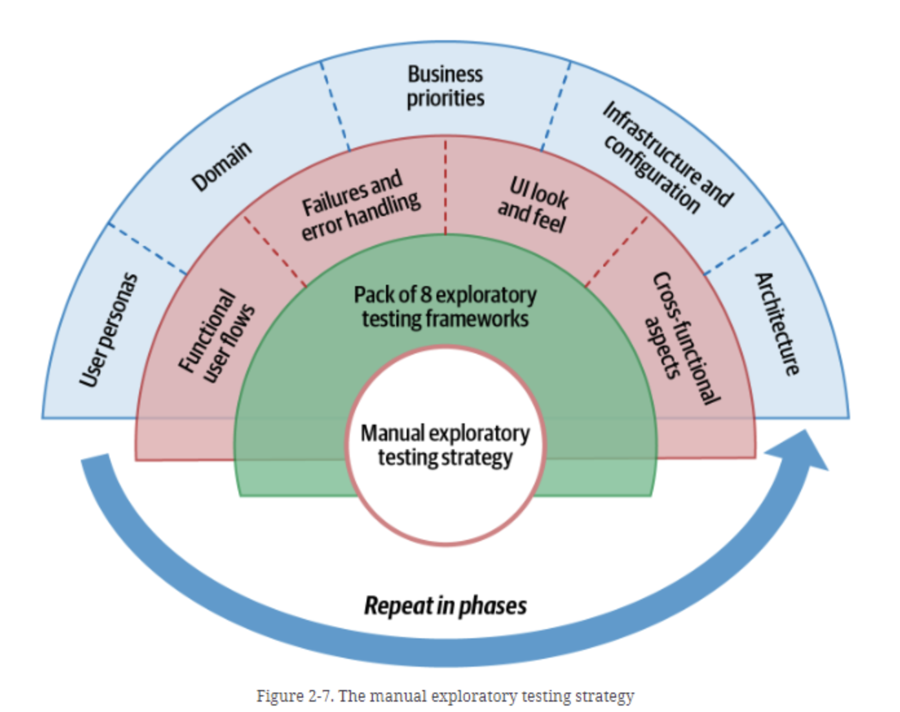
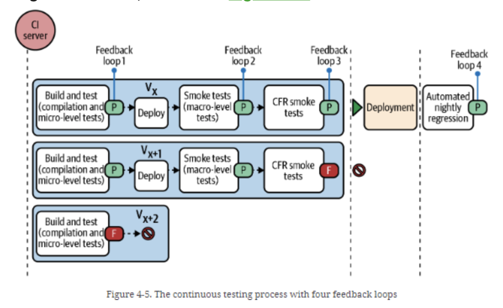
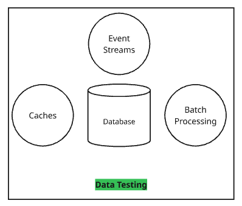
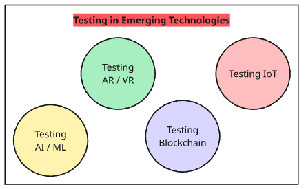

## From tools to strategies

When I started to work as a software tester, I wanted to learn more. In most cases, I wanted to learn about new automation libraries or a fancy tool that solves all my testing problems.

As I got more work experience, I realized that I need to look wider. There are more parts of testing than automation. There are security, performance, mobile, and accessibility testing, and many more. I also found that learning each type of testing is not about the tools. It is learning technology, process, and how to use tools and techniques effectively. 

There is another thing I wanted to understand. I want to understand how those tools and techniques work in the process. To get a more holistic or strategic view.

I started to look at the market. There were separate books about every other aspect. Few books on performance and mobile testing, hundreds of books on security and penetration testing. 

But what if I told you that there is a single book that can walk you through the main concepts of testing and how they are connected nowadays? I am talking now about ["Full Stack Testing: A Practical Guide for Delivering High Quality Software"](https://a.co/d/0i7Rpgk7) book by Gayathri Mohan.

The variety of topics in the book is huge! At first, you will read about manual exploratory testing and automated testing. Then you will see other types of testing: data, visual, security, performance, accessibility, and mobile. At the end of the book, you will also find a few thoughts on how to test emerging technologies, such as ML / AI, blockchain, IoT, and virtual reality. 

In my experience, the more topics you want to cover, the less attention each chapter will get. The quality of the book decreases as the number of topics increases. 

But to my surprise, the ["Full Stack Testing](https://a.co/d/0i7Rpgk7) book is rather than an exception the rule. Let me explain why. 

## 5 insights from Full Stack Testing 

### 1. Strategy for ... exploratory testing

Exploratory testing is a way of testing when you simultaneously design and execute tests. More about the topic you can read in the ["Explore It!: Reduce Risk and Increase Confidence with Exploratory Testing"](https://a.co/d/07CPipvs) book by Elisabeth Hendrickson.

I have experience with approaches and techniques for running exploratory testing sessions. But in the "Full Stack Testing" book, the author proposes a way to form a strategy for our exploratory manual testing.

The essence of the strategy is to use testing techniques to explore discovery paths (functional user flows, error handling, UI look and feel, cross-functional concepts) for the chosen area of focus (user personas, domain, business priorities, infrastructure, and architecture).

### 2. Can you explain continuous testing?

Agile changed the way we deliver software. Many teams today use some form of continuous integration. Some teams use continuous delivery or continuous deployment practices. 

But what about continuous testing? How can we use it?

Quote from chapter 4. "Continuous Testing":

> Continuous testing is the process of validating application quality using both manual and automated testing methods after every incremental change, and alerting the team when the change causes deviation from the intended quality outcomes (c) Gayathri Mohan, "Full Stack Testing."

The most interesting part of the chapter was the introduction of the multiple feedback loops during the testing process:

1. Feedback after micro-level tests
2. Feedback after macro-level tests
3. Feedback after cross-functional tests
4. Feedback after nightly tests

Many people talk about these feedback loops but fail to explain and visualize them properly. You can find a nice and concise visualization in the book. 

### 3. Data testing as a forgotten aspect

Data testing is missing in many testing strategies. The reason is that we assume that the data will be correct and available at any moment in time. 

But in the real application, data testing is crucial. Especially if your system uses databases, event streams, caches, or batch processing.

"Full Stack Testing" provides a few ideas of what we might need to test for a database:

- boundary values based on the column data types and the length of inputs
- inputs that include SQL syntax
- writing to a database during network failures
- retries while writing or reading from a database
- loss of data while concurrent operations
- replication correctness
- more ...

Chapter 5 is full of examples of how different systems that work with data can and should be tested. It's a nice source of ideas for test engineers of any level. 

### 4. Cross-functional requirements testing

Cross-functional testing, as Gayathri Mohan explains in the separate chapter of the book, is just a better way to call non-functional testing. 

But what do we mean when we talk about cross-functional requirements? My first ideas were always performance, security, and usability. But the author shows that there is much more! Accessibility, archivability, auditability, compatibility, configurability, extensibility, localization, observability, reliability, etc. 

The interesting thing here is that you can see a practical example of a cross-functional testing strategy for a product, including suggested tools and approaches. 

### 5. Testing new fancy things

The last chapter of the book provides examples of how to test a set of emerging technologies.

Many of these technologies are not, in fact, emerging. They are already here, and we, as testers, need to be prepared to test it well.

Let me share a few concrete advices for the chapter
1. There are many metrics to validate the quality of the ML model. A few examples are precision (the model's ability to predict results correctly) and recall (the number of true positives out of the total number of true positives and false negatives)
2. Blockchains and blockchain-based applications require unusual types of testing, such as node testing, resiliency, collisions, or data corruption. 
3. To test IoT applications, we need to be aware of the network, interoperability, software, and hardware integration of the devices. 

## Conclusion

Before I go to the conclusions, let me provide a quick pros and cons table of the book (as always)

| Pros | Cons |
| - | - |
| Width and depth of the topics | The reader should have at least a few years of experience |
| One of the best testing process diagrams I've ever seen | Some code samples are redundant |
| Easy to grasp explanations | Some terminology may not align with official (ISTQB) |

"Full Stack Testing" is a solid overview of modern strategies and processes for various types of testing. It is not a junior's first book for sure. 

But if you work in the software testing industry for a few years and you start to get these "there is nothing more interesting in testing" thoughts, these books will help you to see the variety of things that can be done in testing.

Be aware that some of the terms in the book can be different from the ones you are used to. E.g., equivalence partitioning, boundary value analysis, and other similar things are test design techniques, not exploratory testing frameworks. 

If you have 15-20 years of experience, you may not find something radically new in the book. But what you can get is a bunch of carefully crafted visual diagrams of strategies. 

I enjoyed reading "Full Stack Testing" a lot. (And I made a lot of notes from it.)

> P.S. There will be **["Full Stack Testing, 2nd edition"](https://www.oreilly.com/library/view/full-stack-testing/9798341636934/)** soon! 