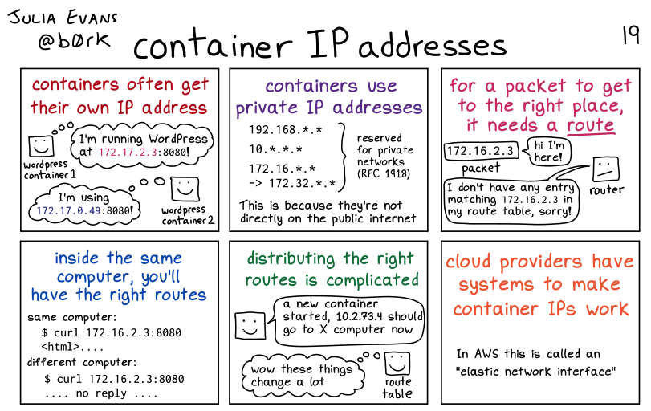
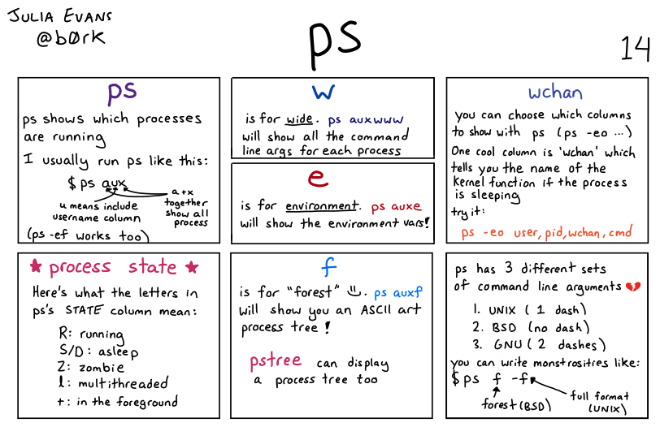
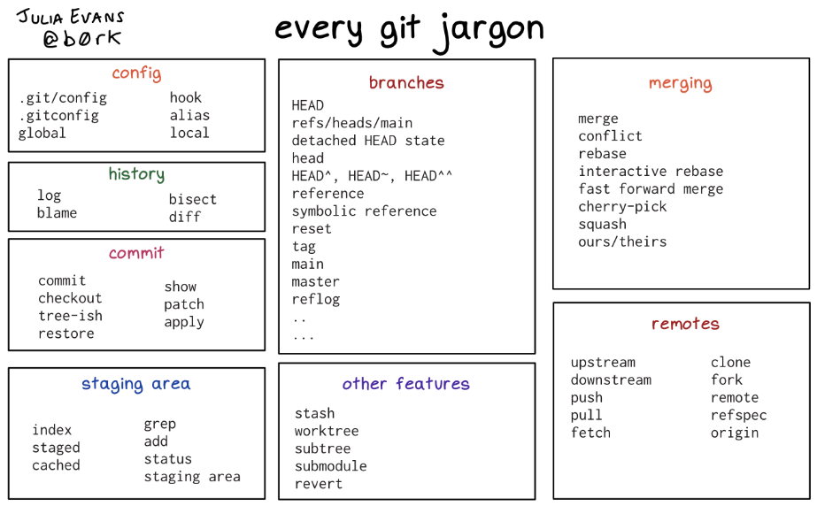
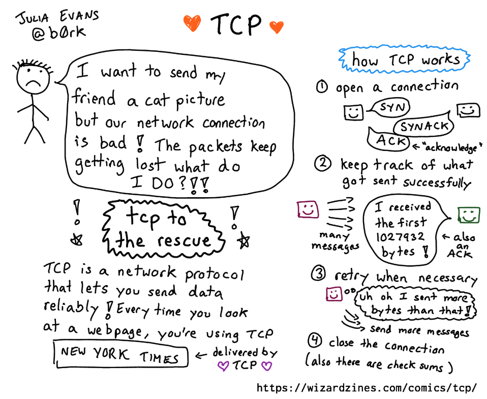

## From blog to comic books

Once upon a time, searching the internet I found a blog post about the [importance of a brag document](https://jvns.ca/blog/brag-documents/). I really liked the idea and the way it was described. The [blog](https://jvns.ca/) was by Julia Evans. She was an engineer at Stripe and talked about technical things in a very easy and engaging way.

Here are a few blog posts to start from:
- [How to ask good questions](https://jvns.ca/blog/good-questions/)
- [Things your manager might not know](https://jvns.ca/blog/things-your-manager-might-not-know/)
- About [interviews](https://jvns.ca/blog/2013/12/30/questions-im-asking-in-interviews/)

Then, I discovered that Julia also writes Wizard Zines. They're short comic books about technical topics. 

Yes, it looks like a comic book. But the key thing that the content is highly practical and valuable.

Why? AI can provide me with a bunch of information, you may say. But this information will be unfiltered and overwhelming.

The value of **[Wizard Zines](https://wizardzines.com/)** is that here you will find the main things you might need in practice. The rest you can explore on your own. 

## One thing I learned from each Wizard Zine

### Bite Size series...

- [The Secret Rules of the Terminal](https://wizardzines.com/zines/terminal/) - how to use copy-paste function in terminal over SSH
- [Bite Size Command Line!](https://wizardzines.com/zines/bite-size-command-line/) - how to re-run command every two seconds with `watch`
- [Bite Size Linux!](https://wizardzines.com/zines/bite-size-linux/) - two types of sockets: `AF_INET` and `AF_UNIX`
- [Bite Size Bash!](https://wizardzines.com/zines/bite-size-bash/) - keep processes running at the background with `nohup ./command &`
- [Bite Size Networking!](https://wizardzines.com/zines/bite-size-networking/) - when to use `dig`, `tcpdump` and `socat` commands

### Wizard Zines

- [How Git Works](https://wizardzines.com/zines/git/) - what's inside `.git` (trees, blobs, reflog, hooks, etc)
- [The Pocket Guide to Debugging](https://wizardzines.com/zines/debugging-guide/) - actionable advice on how to find the root causes of unreproducible bugs
- [How Containers Work!](https://wizardzines.com/zines/containers/) - two ways to block scary program calls: by limiting a container's capability or by setting a `seccomp-bpf` whitelist
- [Become a SELECT star!](https://wizardzines.com/zines/sql/) - `NULL` isn't equal to anything in SQL (`x = NULL` and `x != NULL` are never true for any x)
- [HTTP: Learn your browser's language!](https://wizardzines.com/zines/http/) - HTTP headers that allow browser to avoid downloading unchanged file for a second time: `ETag`, `If-None-Match` and `If-Modified-Since`
- [Oh shit, git!](https://wizardzines.com/zines/oh-shit-git/) - use git time machine with `git reflog`
- [Help! I have a manager!](https://wizardzines.com/zines/manager/) - find out what managers are great at and build support system you need

### Free Zines

- [Let's learn tcpdump!](https://wizardzines.com/zines/tcpdump/) - what packets are coming into my server from 1.2.3.4? `tcpdump port 1337 and host 1.2.3.4`
- [Linux debugging tools you'll love](https://wizardzines.com/zines/debugging/) - `dstat` prints out how much network and disk your computer used that second
- [Networking! ACK!](https://wizardzines.com/zines/networking/) - how to see a TCP handshake with `sudo tcpdump host blabla.com`
- [Profiling & tracing with perf](https://wizardzines.com/zines/perf/) - `perf` as a useful tool for inspecting CPU usage for every function
- [So you want to be a wizard](https://wizardzines.com/zines/wizard/) - it's ok not to know something, even if you are a senior engineer
- [Spying on your programs with strace](https://wizardzines.com/zines/strace/) - `strace` is on Linux. On OSX there are `dtruss` or `dtrace`

> P.S. There are also free one-page posters on different topics: [How to be a Wizard Programmer](https://wizardzines.com/wizard-programmer.pdf), [Every Linux networking tool I know](https://wizardzines.com/networking-tools-poster.pdf), [Debugging Manifesto](https://wizardzines.com/images/debugging-manifesto.pdf), [Git Cheat Sheet](https://wizardzines.com/git-cheat-sheet.pdf), [Terminal Cheat Sheet](https://wizardzines.com/terminal-cheat-sheet-one-page.pdf). 

## Conclusion

[Wizard Zines](https://wizardzines.com/) is a fun and interesting way to present technical information and to learn new things. It's not a substitute for a book or a manual of the tool of your choice.

But Zines are full of practical hacks and advice you can get from a senior engineer. I found a lot of useful info here. I hope you can find it too. You can start with the free zines.

> P.S. As always - check the content. Maybe you don't need to learn about the Linux command line, tracing tools and Docker. In that case, the majority of tools mentioned in the zines will not be applicable to you. 

Choose wisely.

