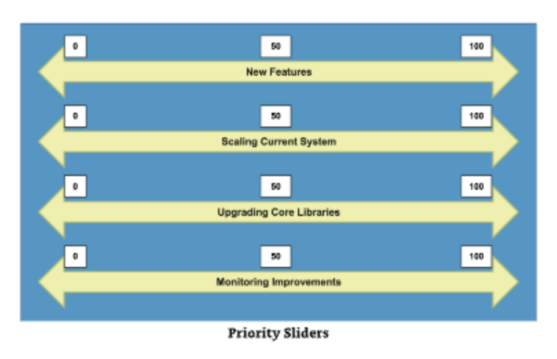
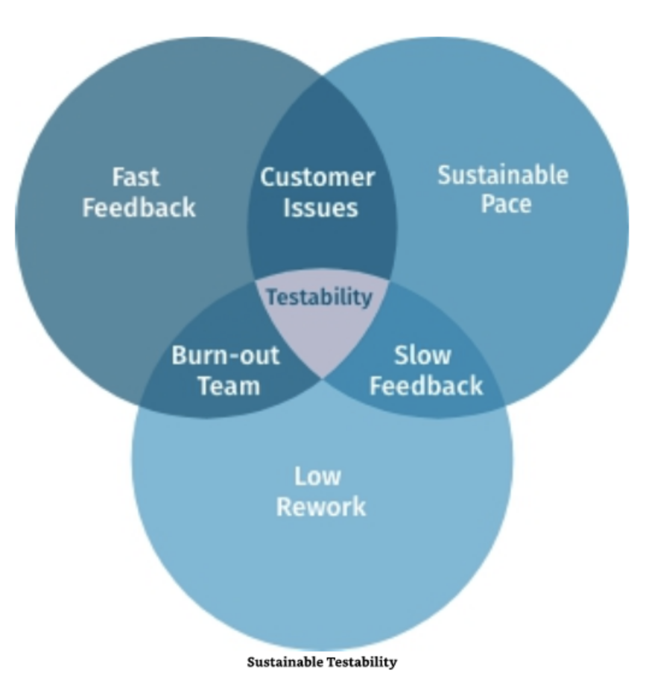
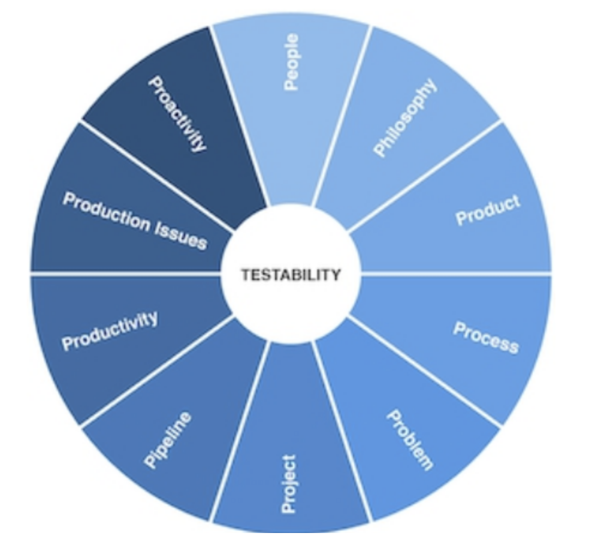

## Mysterious word

I have been working in software testing and engineering for 14 years now. I was a candidate at the interview. I also interviewed a lot of testers. 
At some point in time, I found a few questions that can show whether the candidate is senior enough. 

It's not about the tools. It's not about the patterns or automation. 
The question is pretty simple: "Which steps do you take to support testability of your product?"

This question quickly reveals if a candidate is just "writing automated tests" or "checking the product according to the test cases". It shows whether the candidate knows the product, knows the technology, and can speak to different people to make sure that the product is, in fact, testable enough. That's a clear sign of seniority. 

For a long time, the only explanation of testability was in the ISTQB syllabus or in a few programming books. 
But then I found ["Team Guide to Software Testability: Better software through greater testability"](https://a.co/d/0gQ5k7Hx) book written by Ash Winter and Rob Meaney. The authors did a tremendous job - they explain the topic of testability in simple terms. But Ash and Rob did much more. 

Let me tell you what you can get from the book.

## 5 insights from Team Guide to Software Testability

### 1. The thing everyone talks about

Testability is a fascinating term. Everyone talks about it, nobody really knows how to do it, everyone thinks everyone else is doing it, so everyone claims they are doing it.

What does ISTQB say about testability? 

> The degree to which test conditions can be established for a component or system, and tests can be performed to determine whether those test conditions have been met

Ash Winter and Rob Meaney talk about a testable system, as it

> ... provides information about its own limits, giving your business and technical stakeholders the ability to make crucial decisions at peak times, when reputations can be won or lost. 

More than that. Testability does not exist in a vacuum. It is connected with other properties of the system, such as operability and maintainability. 

The main idea is that even if you, as a tester, care about testability, it does not mean everyone else should care about it. 
That's why we need a way to talk with other people about testability.

["Team Guide to Software Testability"]() provides two things:

1. Explanations of what testability can mean to different people - developers, managers, operations, etc.
2. Examples on how to facilitate the meeting on testability: from a general plan to exercises, e.g., testability trade-off sliders. 

### 2. Applying the CODS model

One of the key points where testability matters is the architecture of the application. If architecture has been built without testability, it may be extremely hard to make the app more testable.

The authors propose the CODS model:
- **C**ontrollability: Ability to control the system to visit each of the system's important states
- **O**bservability: Ability to see everything important in the system to determine where problems may be occurring
- **D**ecomposability: Ability to divide the system into independently testable components
- **S**implicity: How easy the system is to understand

The book also provides a way to talk about this model with your architecture team. 

### 3. Production data in your testing strategy

Another key insight for me was that testability is how well the team understands system usage by customers.

What are the sources of information: usage, performance trends, production incidents, customer support, deployments? 

We need to include this information in the testing strategy to make it more effective. 

### 4. Testability for a long time

How to make testability last longer? I love the diagram that explains sustainable testability.

It's pretty easy to get burnout teams, slow feedback, or customer issues if we lack testability. 

### 5. Ten P's of Testability

The biggest insight that I got from the ["Team Guide to Software Testability"]() is that testability culture emerges as a combination of the ten P's: people, philosophy, product, process, problem, project, pipeline, productivity, production issues, proactivity.

More than that, you need to constantly work on all of them and prioritize testability as a technical debt.

## Conclusion

So, what can you get from this book?
1. Explanation of testability and how it affects the application
2. Clear sample of how to talk about testability with different stakeholders
3. Practical meeting and workshop ideas for teams

The book is "rewiring" the brain to think about testability more holistically. It's not only about adding test IDs to the elements. It's when a test engineer can improve architecture to make testing easier and test results more understandable for the team. 

The only drawback I can find is if you don't care about testability and think that it will be handled by some AI. In this case, you don't recommend reading this book :)

P.S. If you want to learn more about testability - check out [our interview with Rob Meaney at Testing Minutes podcast](https://youtu.be/tQV7raH031I?si=RNnNw1kq-6HG2LL1).