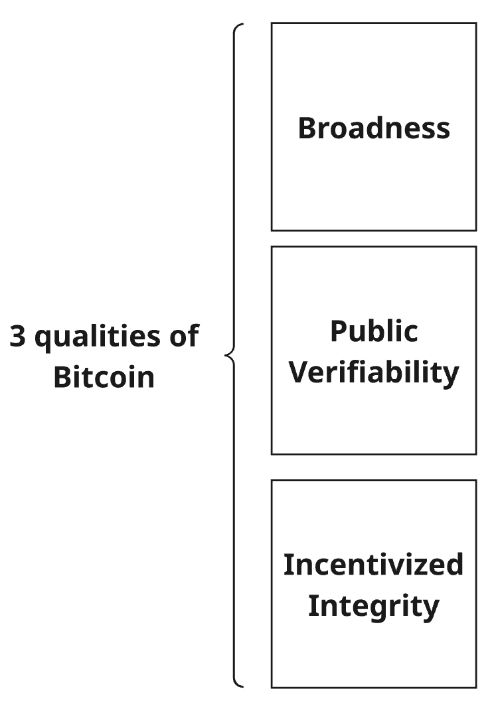
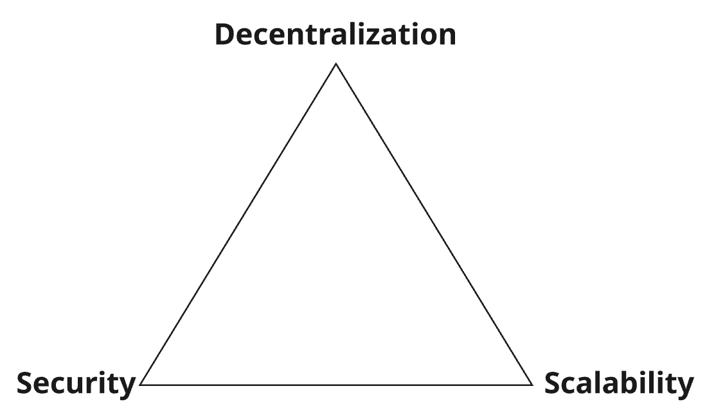
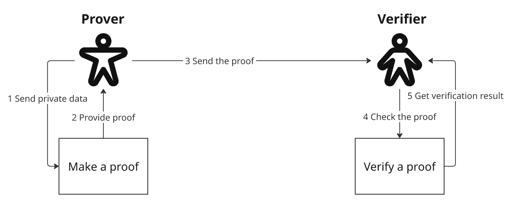

## Yet another blockchain book?

I've read a lot of books about blockchain. 

Some books are deeply technical. These books try to explain each bit of technology under the hood of the chosen blockchain. This task is not easy because technology is constantly evolving, and it is inherently hard to explain to a person without a technical background.

Another type of blockchain book is just a tutorial in paper form. Such books become outdated the time they're published. But they can be somewhat useful if you want an example of an app or library usage. 

A totally different cohort of blockchain books is the ones that tell about technology solely from a marketing or trading point of view. These books keep preaching us the same story of Bitcoin or Ethereum over and over again. The key point in such books is that they see blockchain as the only answer to the ultimate question of life, the universe, and everything. When you read such books in a row, you quickly get tired of the same information written with the same words.

Then what is ["Zero Knowledge, Infinite Trust"](https://a.co/d/06jJ2Veg) book written by Eli Ben-Sasson and Nathan Jeffay? I can tell that it is a mix of different genres. On one side, the book tells about technical things such as blockchains and zero-knowledge proofs. From the other - it is a fascinating story of inventing [STARK proof system](https://www.starknet.io/blog/safe-and-sound-a-deep-dive-into-stark-security/) and [Starkware](https://starkware.co/stark/) as a company. It reminded me of the books about founding famous startups and, a little bit, [Phoenix Project](https://a.co/d/0gTfHIbz). The book is also full of examples of how zero-knowledge as a technology can help humanity in a practical, not theoretical way. 

Let's explore what's inside the book and find an answer to the question - should you read it?

## 5 insights from Zero Knowledge, Infinite Trust

### 1. 3 qualities of the Bitcoin

[Bitcoin](https://en.wikipedia.org/wiki/Bitcoin) - is the first and the most well-known cryptocurrency in the world. For those who want to know the technical foundations, the first stop is to read the famous [whitepaper](https://bitcoin.org/bitcoin.pdf) that lies at the heart of Bitcoin. 

The authors of the "Zero Knowledge, Infinite Trust" book highlight three qualities of Bitcoin:

1. Broadness. Everybody in the system is encouraged to run the system and check if the rules are followed.
2. Public Verifiability. Everyone in the system can check everything since the first block. Everyone has access to any transaction at any block inside the Bitcoin. It is at the same time an advantage and a disadvantage of Bitcoin. Why? Because some people may not want all of your data to be visible to the entire world. Do we want such radical transparency for all the data?
3. Incentivized Integrity. Bitcoin works in a way that rewards a person for following the rules. Many people say that you can't cheat and rewrite the history of the blockchain. That's not true. Cheating is possible, but it is expensive and very dangerous for the adversary.

### 2. Roadblocks to Mass Adoption

If blockchain and Bitcoin are such inventive and revolutionary things, why don't we see mass adoption of these technologies in the world?

Eli Ben-Sasson and Nathan Jeffay remind us that three major roadblocks prevent this from happening:

1. Regulation. There is no single view on what cryptocurrency is. Some countries treat it as a security (like a stock) while others see it as a commodity (like corn and wheat)

2. User Experience. To operate on the blockchain, the user needs to create a wallet with accounts. To create a wallet, the user needs to create a seed phrase. Accounts are not the numbers - it's alphanumeric strings. All these actions and terms are new for the majority of users. What I see since I joined crypto 5 years ago is the constant lack of user experience in many crypto apps and services. New terms become scary and awkward for new users. That's why a lot of people consider not using crypto tools at all in favor of banking applications.

3. Scaling Trilemma. There is a golden rule that prevents any blockchain from being scalable and as fast as any regular payment system - the scaling trilemma. 

The idea is that no blockchain can have three properties at once
- Decentralization (everyone can participate in the system)
- Security (system is resistant to attacks)
- Scalability (the system can handle transactions from millions and billions of users)

### 3. Zero Knowledge Proofs

What is the proof? Proof is 

> a mathematical way of showing that something isn’t just true in a few examples, but must be true in every case, even if the number of cases is infinite.

Zero-knowledge proof (ZK-proof) is a cryptographic way to prove that you know something without revealing what you know. 

There are multiple types of ZK-proos:
- zk-SNARKs. Small, fast, but requires a more complex setup.
- zk-STARKs Large, but more transparent.

Eli Ben-Sasson is an inventor of zk-STARKs. In the book, he stated that a complex setup for zk-SNARKs can be a reason for potential problems and vulnerabilities. He says that zk-STARKs can be more efficient. 

STARK stands for Scalable Transparent ARguments of Knowledge. The main idea behind STARKs is statistical polling: using a small amount of random samples to draw reliable conclusions about a large whole. 

How does it work?

There are two parties: prover and verifier. Prover uses their knowledge to convince the verifier that they have a proof of a mathematical statement.

> The verifier (me) generates a series of cryptographic locks, each shaped slightly differently. 
> The prover (you) responds by opening each one, convincingly, without exposing how you’re doing it. 
> Each round is a fresh challenge. And with every correct response, my confidence grows—not because I’ve learned your secret, but because I’ve seen you handle every lock I’ve thrown your way.

Each ZK proof has the following properties:
- Completeness. If the claim is true, then the verifier will be convinced of it.
- Soundness. If the claim is false, the odds of successful cheating are extremely small.
- Zero-knowledge. The verifier learns nothing from the claim. 

Few materials on the topic:

- [STARK Tutorial](https://www.shirpeled.com/2018/10/a-hands-on-tutorial-for-zero-knowledge_2.html)
- [STARK 101](https://www.youtube.com/watch?v=Y0uJz9VL3Fo)
- [ZK-SNARKs vs ZK-STARKs](https://hacken.io/discover/zk-snark-vs-zk-stark/)

### 4. Do we need crypto?

The authors state that with proofs, we brought two things to the blockchain: scale and privacy.

- Results for multiple transactions can be packed into a single proof. This proof can be verified very quickly. That brings scalability
- Zero-knowledge technology gives the ability to prove facts without revealing any transaction details. That's privacy.

Both of these properties allow us to build secure and scalable systems without central authorities. It enables the creation of a multitude of applications that allow users to control their data, not the companies or banks. 

### 5. Integrity Web

The main idea of the book is that blockchain and ZK proofs enable the creation of what the authors call the Integrity Web - an internet where trust is no longer assumed, but proven. 

Old systems, such as banks and governments, require us to blindly trust. If something, like data, is leaked or an account is blocked, those corporations are faceless, so we can't even talk to them. 

New systems have trust encoded in the DNA, with the help of math and cryptography. Those systems work without revealing private data. Once you make a transaction, you can prove it.

An ability to prove things will also work with AI and LLM models. The authors provide an example that programs that are trained on data can use a blockchain to prove that this data has not been tampered with over time. So we, as users, can check the origin of the information more reliably. 

## Conclusion

It is hard to write a good book on blockchain. Why? Because it is hard to imagine what the potential audience. 

- People without tech experience will be puzzled by terms like distributed systems, hashing, and cryptography. (I'm not talking about the math behind the ZK proofs)
- People from the crypto industry will be bored to read about inventing Bitcoin and Ethereum again and again.
- People from software engineering will expect algorithms or libraries to use from day one.
- People from the math industry will need only proofs and formulas instead of describing the struggles of getting through academic conferences.

I think that Eli Ben-Sasson and Nathan Jeffay did a great job in their book ["Zero Knowledge, Infinite Trust: The Evolution and Revolution of Blockchain Technology"](https://a.co/d/06jJ2Veg). 

Here are a few reasons why:
- The authors explained the foundational knowledge of blockchain in the most approachable way. 
- They stated the problems in the technology, and ZK-STARK can solve them. 
- They told a fascinating story of how the invention went through rejection in academic circles to the 8 billion dollar company. 
- They provided a lot of examples and analogies (like sampling in a pool) for people to understand how ZK proofs work

What will you not find in the book?

1. Detailed description and math behind ZK-STARK. *But you can read original whitepapers*
2. Code samples of proofs and libraries to use them. *You can find it on official websites and GitHub*
3. Detailed technical explanations of blockchain terms. *I can advise to read [Mastering Blockchain](https://testengineeringnotes.com/posts/2026-05-28-mastering-blockchain-review/) book instead*

Do you know about zero-knowledge proofs?