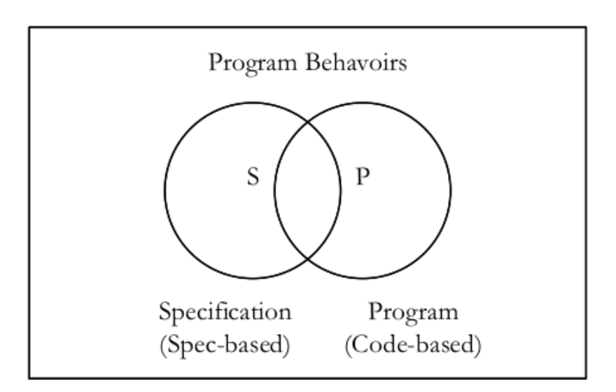
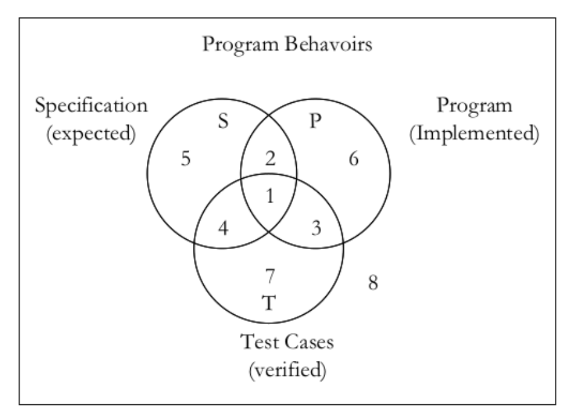
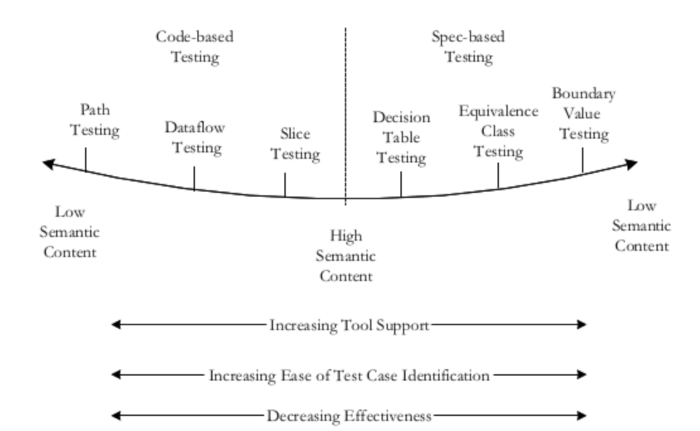
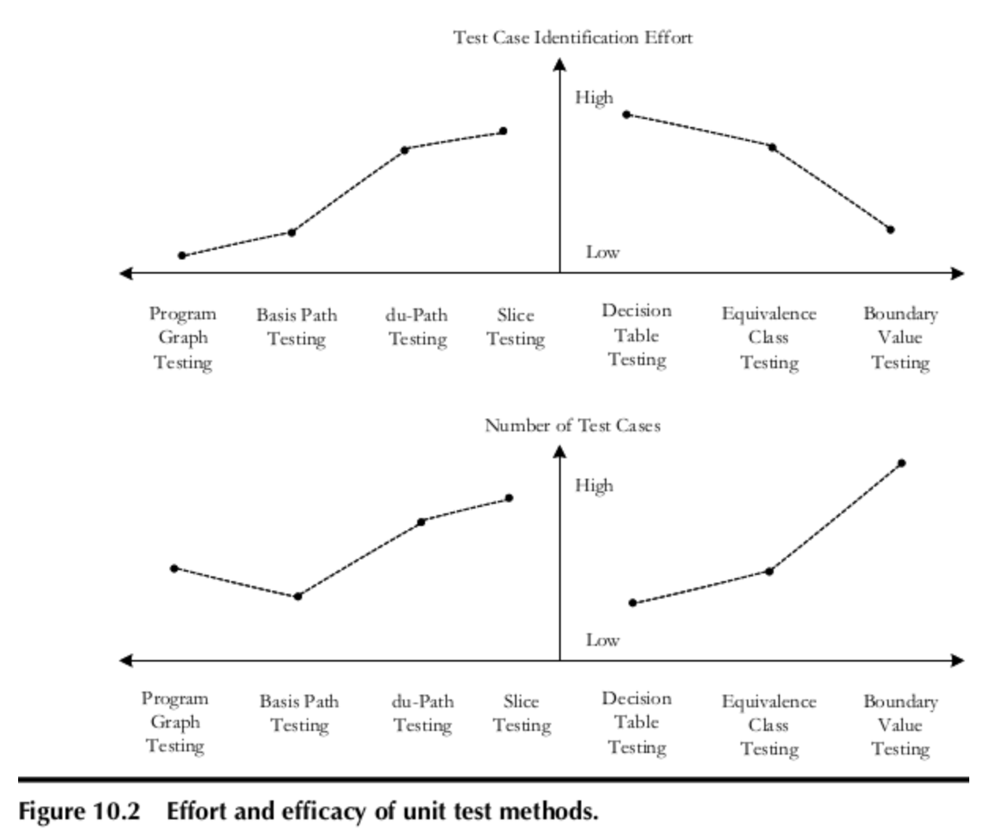
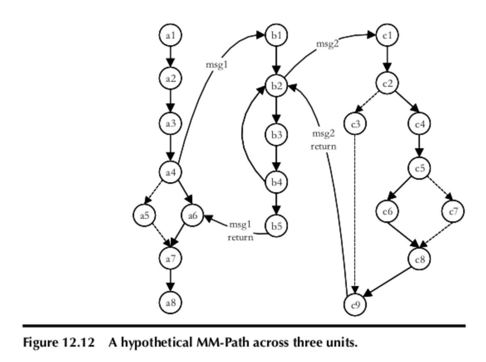
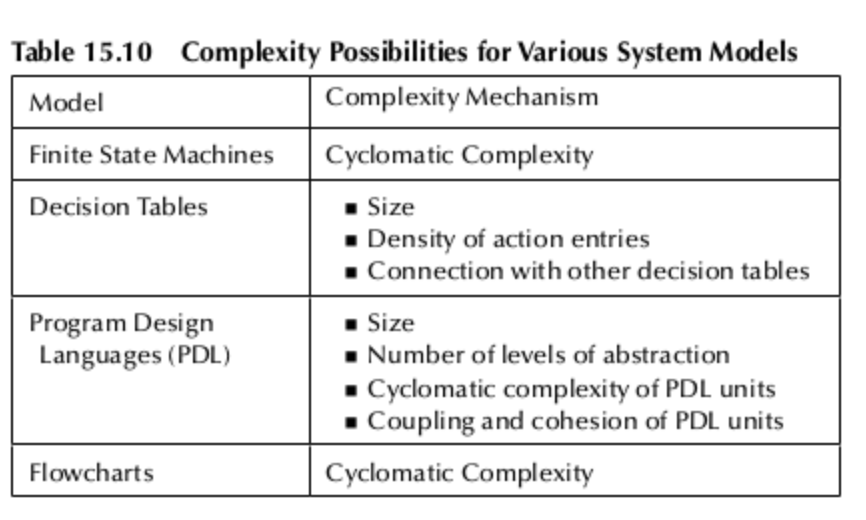
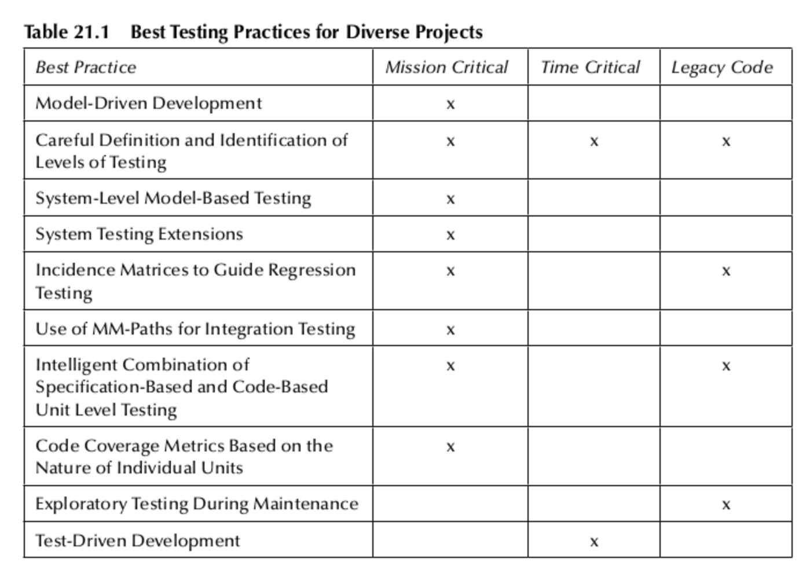

## Testing from the developer point of view

The majority of software testing books are written by software testers. It is a rare case when a developer writes about software testing. It's even more rare to see a testing book written by a professor of computer science. 

But I found this rare book! It is ["Software Testing: A Craftsman`s Approach"](https://a.co/d/09u3Bzcb) by Paul C Jorgensen. 

Let's see how this book differs from the regular testing book. I am curious... do you?

## 5 insights from Software Testing: A Craftsman's Approach

### 1. Behaviours we actually test

Testing is the way we check program behavior. But behavior can be split into two big piles: spec-based and code-based.

Spec-based view is a representation of what the program does. And the code-based view is what a program is. 

It is important to test both spec-based and code-based parts. Testing adds a third view - which behavior was checked.

In the [Software Testing: A Craftsman's Approach](https://a.co/d/09u3Bzcb) book, we can find a nice Venn diagram that shows this concept

At the intersections of the three groups emerges an interesting situation.
- Ideally, we need at least to verify what is in the specification and in the code (1)
- We, as testers, can miss (or choose not to test) some specified behaviors (5) or code ones (6)
- We can cover with tests specified (4) and coded behaviors (3)
- We can also cover with tests behaviors that don't belong to any category (7)
- One of the potential sources of bugs is when we misspecify and code functions (2)
- More than that, countless other behaviors are not specified, coded, or even tested (8)

### 2. Test - Design for Unit Tests

When we learn about testing, we study test-design techniques. Many testers think that these techniques are applicable mostly at the end-to-end test levels. The reason is that testers are responsible for end-to-end UI and API tests, while developers write unit and integration tests. But in fact, all those techniques can (and should be) used by developers at the unit testing level as well. 

More than that. Developers should not only use code-based techniques such as path, dataflow, or slice testing.
They also benefit from using spec-based approaches - boundary values, equivalence partitioning, and decision tables. 

Paul C Jorgensen provides a graph that illustrates how much effort and the number of cases are required for each type of technique.

### 3. Integrations and non-trivial system testing

Another topic that often emerges at the testing courses is integration. The topic seems highly theoretical because testers usually do not do integration much. But testers do test the results or such integrations.

The majority of books mention that there are three (sometimes four) main integration approaches: top-down, bottom-up, sandwich, and big-bang.

But in the [Software Testing: A Craftsman's Approach](https://a.co/d/09u3Bzcb) book, we can find out about more types: 
- call graph-based integration (consider unit to be nodes, and if unit A calls (or uses) unit B, there is an edge from node A to node B.)
- path integration (when a unit executes, some path of source statements is traversed)
- pairwise integration (instead of developing stubs and/or drivers, why not use the actual code)
- neighborhood integration (uses a notion of a neighborhood from topology)
- model-based integration (verify that every message has been sent to, and received by, the correct recipient)
- FSM/M path integration (consider how units, as finite state machines, are exchanging messages)

### 4. Flavors of complexity

[Software Testing: A Craftsman's Approach](https://a.co/d/09u3Bzcb) has one of the best descriptions of software complexity types. 

First thing to remember is that at each level of the "testing pyramid" we have complexity:
- at the unit level, we have cyclomatic, decisional, and computational complexity of the functions
- at the integration level, cyclomatic complexity is applied to the call graph (message traffic) and also object-oriented complexity (CK metrics)
- at the system level, single-processorr applications can be expressed as an incidence matrix

### 5. Ten Best Practices for Testing Excellence

At the end of the book, the author shares ten best practices for testing excellence. If you practice a context-driven testing approach, I remember that there are no best practices, but only good practices for a given context. 

But anyway, here are those practices
1. Use technical inspection to define the type and level of testing
2. Identify test levels carefully
3. Use a model-based testing approach where possible
4. For complex applications, thread interaction testing is needed
5. Incidence matrices help with regression testing
6. Use mocks and stubs at the unit testing level
7. Use both spec-based and code-based testing techniques at the unit level
8. Use tools that work best for a particular test level
9. Use exploratory testing during maintenance
10. Use TDD and corrective maintenance approaches

## Conclusion

[Software Testing: A Craftsman's Approach](https://a.co/d/09u3Bzcb) is the situation when a software engineer writes a book about software testing. 

It is the first book on testing, where I find a lot of deeply technical information. One example is that **there are chapters about discrete math and graph theory for testers!** It is a clear example that software testing is a technically complex craft. It's not just randomly clicking buttons (by human or automated tests)

The book is not easy. I can compare it with [Designing Data-Intensive Applications](https://testengineeringnotes.com/posts/2021-07-26-ddia-for-testers/) by Martin Klepmann. Be ready to spend time reading.

The book may be outdated in some parts (It was published in 2013!). There is no mention of AI. There is no mention of fancy libraries or tips and tricks for vibe coding. 

The topics in the book are mostly universal and applicable to any system. 

I can recommend this book to developers who want an in-depth guide to the software testing world. 

I recommend it for testers, especially if they enjoy the technical side of testing.
