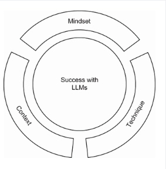
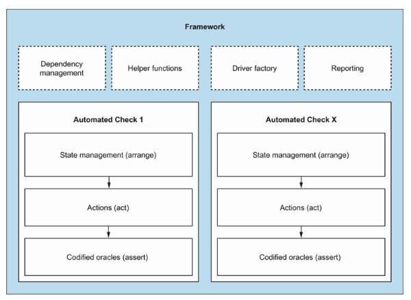
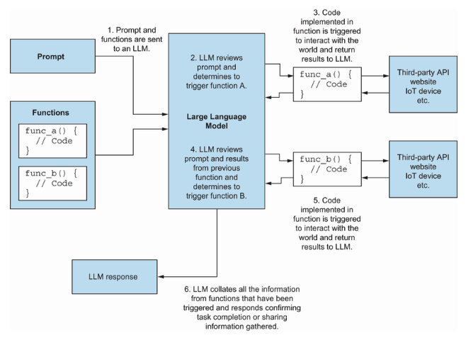

## Testing book about ... AI!

I am always happy to find a testing book about modern technologies such as AI.

When I discovered ["Software Testing with Generative AI"](https://a.co/d/0fs5lm4a), I already knew that this book would be good. The main reason is that I know that Mark Winteringham is a highly knowledgeable engineer who can present complex topics in a way that is understandable. 

But what can you find in this book? Overall, the book explores the topic of using LLMs in day-to-day testing activities. 

In detail, you will find:
- What are the principles of effective prompt engineering
- What are the pros, cons, and risks of using LLMs for testing
- How to use LLMs to write automated tests (not just blindly generating a bunch of code)
- How to create a useful test plan with LLMs
- How to generate test data at scale for automated tests
- How to use AI agents to help you with testing
- how to improve and augment basic LLMs to produce better results

## 5 insights from Software Testing with Generative AI

### 1. AI will augment the way we work, not replace

Many test engineers are afraid that AI will take our jobs. What Mark tries to answer in the first chapters of the book is that AI will not substitute human work entirely. But AI will augment the way we work. 

Humans are at the center to provide direction and extract feedback because AI tools lack context and purpose. 

AI can help testers expand their "area of effect" and investigate more, think deeper, and solve more complex problems.

Additionally, I want to mention the model that Mark proposes on how to use LLMs successfully:

It's a combination of mindset (having a clear sense of purpose and value of testing), technique (understanding how to use LLMs), and context (how to maximize the usefulness of the AI).

### 2. Tools do checking, Humans do testing

Mark draws a clear line between checking and testing. Tools (and AI) are great at checking. The majority of checking can (and should) be automated. But tools have a thing called automation bias - when the test is "green" even if the app is not working at all. The explanation is pretty simple: automated tests and tools check only the things we told them to check. (Here may be a [reference](https://developsense.com/blog/2009/08/testing-vs-checking) to the articles of Michael Bolton)

Mark also shares a diagram of the automation framework:

Testing on the other side is about observing and analyzing a lot of simultaneous events at the same time. As Matthew Heusser and Michael Larsen told in the [Software Testing Strategies](https://testengineeringnotes.com/posts/2026-05-25-testing-strategies-review/) book:

> “At the end of every human-run, pre-designed, documented test is a hidden expected result: … And nothing else odd happened.”

Humans are very good at spotting this "nothing else odd happened" part. 

### 3. The Risk of Hallucination

AI and LLMs in particular are not deterministic, so they rarely provide an answer as a strict "true or false". LLMs are probabilistic in nature: they use statistics to determine the most probable token at this moment. 

As a result, it leads to a problem of hallucinations, when AI generates a text that looks like a correct one, but in fact is completely false. 

Another point that Mark covers in his book is that with LLMs, we can witness an example of "law of diminishing returns" - the more test ideas we ask to generate, the more hallucinations we will get. 

### 4. Better prompts lead to better results

Main advice from Mark regarding using LLMs for testing is to move from basic general prompts. We can use models of our systems and ask better, more specific prompts. 

One example of models can be some way of abstraction - an architecture diagram or user flow diagrams. Of course, to use these features, we need to be aware that we, as employees, do not share any sensitive information with the public. 

Another example is to use testing heuristics, such as SFDIPOT. (There are many more, just explore!).

### 5. Context is a key

The more context we provide to the system, the better results we can expect. Gathering the context from various sources, crafting it into manageable chunks of information, and elaborating on the output of the AI instrument are another set of our responsibilities as testers. 

But, actually, developers and other engineers who work with AI do the same. So - we are not alone in this thing. 

Speaking about agents. Mark provides a nice diagram, explaining how agents work with LLMs:

## Conclusion

Before moving to a conclusion, let me share a few things **you will not find** in the ["Software Testing with Generative AI"](https://a.co/d/0fs5lm4a) book:
- nothing about testing AI models themselves
- examples of the latest tools and libraries (book was published in 2024)
- step-by-step tutorials on creating AI models (there are a lot of other books and courses on this topic)

Overall, **I really enjoyed the ["Software Testing with Generative AI"](https://a.co/d/0fs5lm4a) book**. Mark did a good job compiling practical knowledge on techniques we can use to test and write test code with AI. This book can be a good starting point to explore the world of AI and to use LLM tools more effectively. 

By the way, there are not so many books on AI in testing yet. So this book is a gem. 

> P.S. If you are interested in learning how to do API testing effectively, check out also the other book from Mark Winteringham - ["Testing Web APIs"](https://testengineeringnotes.com/posts/2026-05-16-testing-web-apis-review/).

