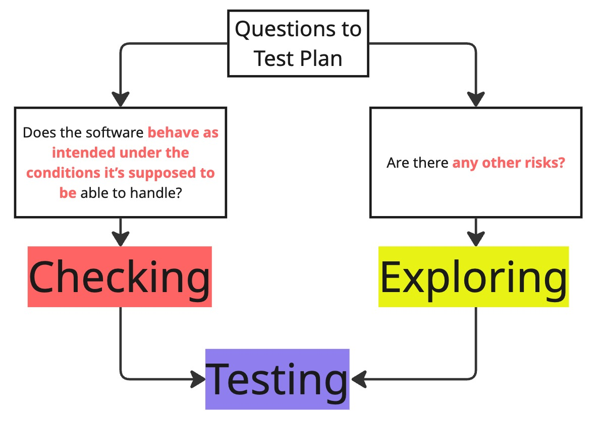
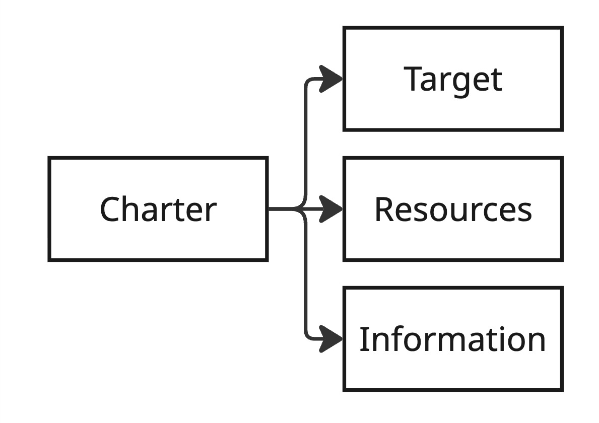
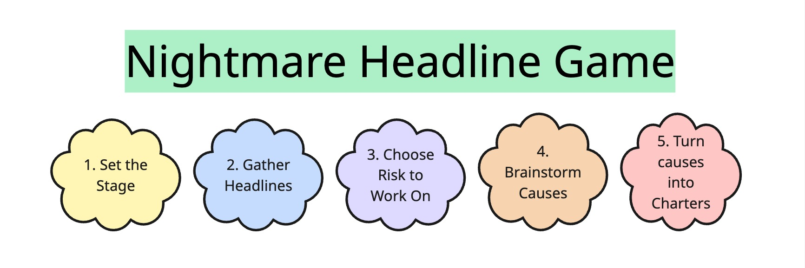

## A topic that everybody forgets

There are a lot of books on software testing. Most of them teach you how to write test cases, plans, and reports. Some of the books will tell you how to write automation code. 

But many testers neglect the craft of exploratory testing. The maximum of what you can hear is "it's testing without test cases - like random clicking here and there".

But the thing is that exploratory testing is itself a separate and yet useful tool in a toolset of the modern tester. In the age of AI, exploratory skills become even more valuable. 

One of the best books on exploratory testing is ["Explore It!" by Elisabeth Hendrickson](https://a.co/d/08uC3aur).

Let's write a charter and start our exploration:

> Explore the "Explore It!" book to discover new insights and approaches for testing

## 5 insights from Explore It!

### 1. A tale of two sides of testing

I always thought that I knew what testing is. But Elisabeth Hendrickson has put my knowledge in question. 

First thing she says is that we don't need a perfect set of test cases. We need a test strategy that answers two core questions:
1. Does the software behave as intended under the conditions it’s supposed to be able to handle?
2. Are there any other risks?

**Checking** answers the first question with test cases that you design in advance. A nice metaphor here is that checking is like a safety net to catch bugs.

**Exploring** involves searching around the areas that these safety nets do not cover. Exploratory testing is about designing and executing a series of experiments while observing the behavior of the product.

The main idea is that **tested = checked + explored**. You can't skip either part. 

### 2. Charters and where to find them

The heart of the exploratory testing is a charter. 

As an example of a charter, "Explore It!" provides a story about Thomas Jefferson, the third president of the United States. Once upon a time, he gathered famous explorers, Lewis and Clark, and set them a mission - to discover a route across the continent from St. Louis, Missouri, out to the Pacific Ocean.

Jefferson described a charter in the following way:
- Where to explore: the Missouri River and connecting waterways
- Resources: equipment such as boats, tents, surveying tools, weapons, and even presents for the native explorers they would encounter
- Information to seek: trading routes

With these examples in mind, Elisabeth gives us a schema of the exploratory testing charter:

- **Target**: a feature, a module, even a requirement
- **Resources**: tools, data, techniques, configs
- **Information**: what do we expect to find and explore?

E.g., here is the example of the charter from the book:

> Explore input fields with JavaScript and SQL injection attacks to discover security vulnerabilities

### 3. Uncover risks with the game

I really liked the game called **"Nightmare Headline Game"** that Elizabeth proposed to uncover the hidden risks. 
This game is not only for testers - it's for the whole team.

How to play in the game
1. Set the Stage: "Imagine that you open a news feed and find the latest scary news about yesterday's major release"
2. Gather Headlines: ask team members to write down what the headlines of those scary news stories can be
3. Choose a Big Risk to Work On: together with your team, decide what the scariest headline (risk) to work on is
4. Brainstorm Contributing Causes: ask a question, "What could possibly cause this problem?" Write down the answers
5. Refine causes into Charters

### 4. Forms of explorations

Elisabeth Hendrickson tells about multiple forms of exploration. 

- Explore requirements: listen for "-ilities", as they will tell you about the important information
- Explore existing system: with a **recon session** and interviewing stakeholders, you can find out new ideas to explore in the features you already know
- Explore with UI: check the source code of the application, the schema, or the API for a service

### 5. Recognizing exploratory skills

Another thing that can be found in the "Explore It!" book is an example of an interview for exploratory testing skills.

The goals of the interview are:
1. Can the candidate explore systematically to uncover vulnerabilities and surprises?
2. Can the candidate effectively communicate what was discovered?
3. Does the candidate adjust the kind of information sought based on feedback?

This approach can be extended to any type of application or a product for a tester at any level. The only difference is the depth and width of exploration and questions. 

## Conclusion

Let's start with a con. The book was published in 2013. It's pretty old in terms of how AI is evolving.

But what makes ["Explore It!"](https://a.co/d/08uC3aur) useful is that the approaches are applicable to any kind of system - even an AI-based one. You can explore your software whenever you want. Techniques are universal. 

The best advice that you can get from the "Explore It!" book is **" when the map and the territory differ, believe the territory.**

["Explore It!"](https://a.co/d/08uC3aur) by Elisabeth Hendrickson, paired with ["Exploratory Software Testing: Tips, Tricks, Tours, and Techniques to Guide Test Design"](https://a.co/d/08OGwgY3) by James A. Whittaker, will cover a lot on the topic of exploratory testing. 

Requirements, user stories, and test cases are a map. The actual software is a territory. Exploratory testing is about exercising the real working software and evaluating it critically (*now, Rapid Software Testing principles and terms are somewhere near*).