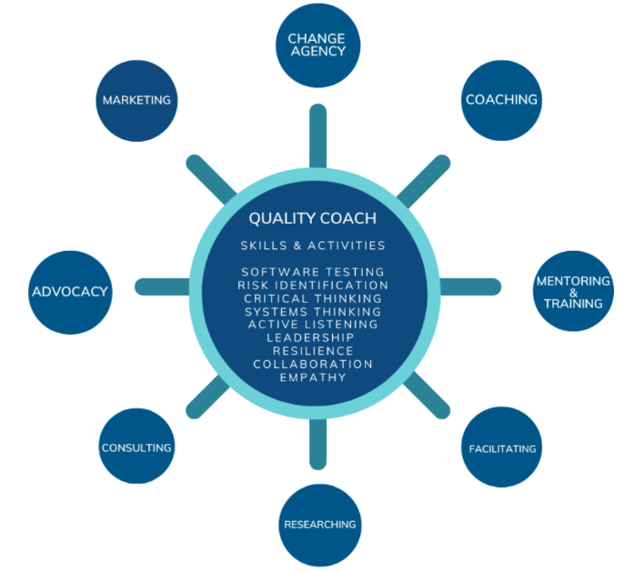
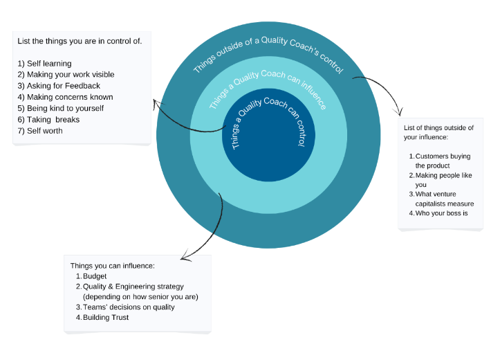
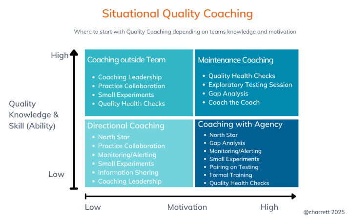

## A topic that everybody forgets

IT industry is constantly evolving. Testing and quality are also in constant motion. One dimension of the move is the technology: automation, programming, tools, AI. The other dimension is the process - agile testing, shifting left and right.

But another way to see quality is when you are outside of the processes, but at the same time you have responsibility for the overall success. Here comes the quality coach role. Quality coach is not a replacement for testing - but they are the catalyst.

In the ["Quality Coach's Handbook"](https://leanpub.com/qc), Anne-Marie Charrett researches the topic of quality coaching and provides an in-depth overview of tools, processes, and visions to become an effective quality coach.

Quality coach is a somewhat new term for me, so let's explore the topic together.

## 5 ideas from Quality Coach Handbook

### 1. From a Tester to Quality Catalyst

When you are a tester, you know what to do and how it will be evaluated. Test this feature according to a test plan. Do an exploratory testing session. Automate these tests using technology X. File these bugs into the tracker. 

The biggest shift from testing to quality coaching is the **move from doing the work to facilitating the work.** What does it mean?

- Help the whole team to be good at testing
- Assist the team to find gaps between expectations and reality
- Ask a question: "How does the team know if the feature is the right one to build?"
- Help the team to create their own testing strategy
- Facilitate the team to uncover risks and to decide on the depth of testing

It is easier said than done. All these actions require a blend of technical awareness, process knowledge, and an ability to talk and persuade.

### 2. Make yourself ... dispensable

**The overall goal of such facilitation is to become dispensable.** The idea is a bit contradictory: the goal of a quality coach is to become a redundant one-time. So the team knows what to do with testing, how to do it well, and how to improve it over time.

Anne-Marie Charrett emphasizes that becoming redundant is an ultimate success metric for a quality coach. By stepping back, a coach can force the whole team to deal with quality in real time. 

I think it is the biggest and the hardest mindset shift for any experienced quality engineer. But at the same time, a bit similar shift emerges when you move from an individual contributor role to a management role. Here, the goal is also moving from being a bottleneck of the process to becoming an enabler. 

### 3. The rituals of quality coaching

To move to a quality assistance model, the team should use the **YBIYTIYRI** philosophy: "You Build It, You Test It, You Run It."
Apart from concrete engineering changes, a quality coach can do the following rituals.

1. **QA Kickoff** - before any line of code is even written. The quality coach can do a pair session with the story owner to discuss risks and approaches to testing
2. **QA Demo** - occurs when coding and testing parts are complete. The goal of the coach here is to use their expertise to explore possible gaps even further.

The main idea here is that the story is not finished until the story owner and quality coach are satisfied. But at the same time, the final word is always with the accountable person - the story owner.

### 4. The notion of circles of influences

One of the hardest tasks of the quality coach is to communicate and persuade different groups of stakeholders. Each stakeholder has their own goals and motivations.

Anne-Marie Charrett offers a nice way to manage focus - using three circles:

1. **Circle of Control** - where you should invest in yourself, your coaching approach, and skills.
2. **Circle of Influence** - where a quality coach can suggest and advocate. But he or she can't guarantee outcomes here.
3. **Circle of Concern** - outside of the coach's influence, e.g., senior leadership decisions, market conditions. The only way to deal with it is to ... acknowledge.

### 5. Adapt coaching style to the situation

At first glance, the work of a quality coach is just to get to the team, show them "the right way," and observe how everything went fine. 

But the author says that the **master quality coach should adapt their coaching style to the ability (knowledge and skills) and motivation (energy) of the particular team.** Do not just throw a bunch of information without any guidance!

["Quality Coach's Handbook"](https://leanpub.com/qc) offers the following matrix

- Low Ability and High Motivation. Coach should offer team choice and act as guided agency
- Low Ability and Low Motivation. Coach here should deal with skeptical teams. Focus on awareness and education. Work with managers first.
- High Ability and High Motivation. Such teams are a dream for a quality coach. Do regular health checks and gap analysis. Move the team to become coaches for other teams.
- High Ability and Low Motivation. Work with senior management to change the overall culture and increase motivation.

## Conclusion

The topic of quality coaching is an interesting one. I think it can be one of the possible ways to grow for senior testers and test leads who want bigger challenges and do not want to switch into automation or architecture.

Quality coaching is hard because you often need to deal with people who do not see value in testing or quality. You need to persuade them that quality is needed. But ... isn't it the thing we, as testers, do occasionally, at our jobs every day?

I can recommend ["Quality Coach's Handbook"](https://leanpub.com/qc) if you want to switch to a quality coach role. But this book will be useful even if you are a senior tester or test lead. Here you can find a lot of tips and rituals on how to work with teams and influence the quality.