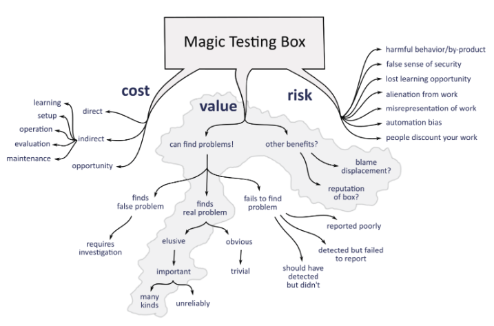

## The book we've waited for

If you work in software testing for more than a few years, you may have heard of these names: James Bach and Michael Bolton. They have both worked in testing for more than 30 years. They have a vast amount of knowledge and experience. But more than that: they are exploring a notion and essence of testing at much deeper levels than just a day-to-day job of checking software with tools. 

Together they created a methodology called **"Rapid Software Testing"**. They taught this methodology in the form of courses and master classes for decades now to various groups of software testers around the world. 

Rapid software testing belongs to a **context-driven school**. If you want to explore the principles behind this school, I recommend starting with the [official resource](https://context-driven-testing.com/).

If you want to read them, here are the blogs:
- [James Bach blog](https://www.satisfice.com/blog)
- [Michael Bolton blog](https://developsense.com/blog)

When I found out that James and Michael would are working on ["Taking Testing Seriously: The Rapid Software Testing Approach"](https://a.co/d/09g1OA8f) book, I already knew that it would be a good one. 

Let's dive into the world of rapid software testing. James and Michael will make sure that our journey will be safe and sound. 

## 5 big ideas from "Taking Testing Seriously"

### 1. Humans do testing, machines do checking

One of the main ideas of the [book](https://a.co/d/09g1OA8f) is that the authors draw a fine line between two activities: **testing** and **checking**. 

But what is the difference? Let me explain. 

**Testing** is evaluating a product by learning about it through experiencing, exploring, and experimenting with it. 
**Checking** is a mechanistic process of verifying propositions about the product. Checking can (and should be) minimized as a set of true-false statements.

As a result, checking is easy to automate with scripts or code. Testing is hard to automate (even with AI!).

**Good testing, of course, involves checking**. But evaluation of the product is much more than plain true or false.

It reminds me a bit of [Matthew Heusser's maxim of documented testing](https://testengineeringnotes.com/posts/2026-05-25-testing-strategies-review/): 
> “At the end of every human-run, pre-designed, documented test is a hidden expected result: … And nothing else odd happened.”

To make us understand the distinction between testing and checking, James and Michael compare activities to **programming and compiling**. Nobody says that they do "manual programming" or "automated programming". The part where machines do their part to make a build is called compiling or building. 

Well, why bother with those definitions? Why not just test it without questions? The answer is **accountability**. 

A test engineer is accountable for providing information about what was tested and where the potential risks are. A green report does not automatically mean that there are no problems in the software. Any results should be evaluated and processed by a responsible tester. 

### 2. Testing is not a document, it's an event

I like how James and Michael compare the act of testing to ... a Broadway play. **The script is not a play**. Actors follow the script when they are on stage at a particular time and for a particular audience. 

Same as a script, the test case is just an entry point for a real testing activity. Authors encourage the readers to use the "script" (test case) and improvise depending on the additional conditions.

Do not treat a test case as a sealed box that produces the same results each time you run it. It should be an automated check. Give it to a machine and leave the exploration part to humans.

### 3. Quality is a value to someone (... and you don't own it)

What is quality? 

There is a famous Jerry Weinberg's definition of quality: 
> **Quality is value to some person**

But the authors give an even more precise definition:
> **Quality is value to some person *who matters*.**

The addition seems very small, but it changes a lot. It says that quality is more about the relationship between the builders and the sheer number of particular users. People who matter change - so the quality of the product.

The next thing that the author says in the book is that testers do not control, assure, or ensure quality. Release is a business decision, not a tester decision. Your goal is to gather information, analyze it, and flag it where the risks arose. It's up to management to decide what to do with this information.

Speaking about the risks. The risks can be **unknown**, **identified**, and **tested**. How to deal with them?
- Do shallow testing to unknown risks
- Do deeper testing to identified risks
- Gather evidence from tested risks and present opinions

More about deep and shallow, narrow and broad testing - in the [book](https://a.co/d/09g1OA8f). 

### 4. AI is a magic box

I find the explanation of AI made by Michael and James fun yet valuable. 

The authors compare AI to a ... magic testing box. You don't know how it works. But the leprechaun who gave it to you told you that you need to put this box somewhere near the product, do some rituals, and ... the box will magically find and report bugs.

But the first question that a professional tester should ask is - *"Did it do a good job?"*

The [book](https://a.co/d/09g1OA8f) shares a few heuristics to work with AI in testing:
1. If something matters very much, don't rely on magic to get it.
2. If something matters very much and you have no other way to get it, you might as well try magic.
3. If something matters very much and you resorted to magic, responsibility demands that you test it.

The main idea here is that you need to be careful with outsourcing all the learning and exploration to a mysterious AI agent instead of doing learning and evaluation by yourself. It does not mean that you should not use AI. Just be aware of the consequences (like a phrase on the real magic box).

### 5. Telling bugs like a story

Another valuable idea is that we, as testers, should not just look for and report bugs. We need to learn storytelling techniques to present bugs better. 

James and Michael share an approach to help us with telling bug stories - by asking three questions: **what's up, says who, and so what.**

- **What's up?** What's different today compared to the previous runs
- **Says who?** Why should anyone believe you? What is the evidence?
- **So what?** Help the audience to make a decision. State the risk

These questions also reminded me about one of the key problems that I saw in many teams. The problem is low credibility of the tester inside the team. You, as a test engineer, should prove with evidence that you have knowledge and skills to do valuable and in-depth testing. Do not rely solely on the title. Each team brings new tasks to prove credibility before you will be considered a valuable team member. 

## Bad parts and cautions

What I did not like in the book and what you should be prepared for:
- The book is written by the creators of the "Rapid Software Testing" methodology. The authors have their own strong opinions about modern schools and certifications, such as ISTQB. (That's totally expected)
- As a result: there are some chapters about how RST changes lives. The last part of the book is about becoming an RST instructor.
- The chapter about the Post Office scandal may be excluded from the book, in my opinion. It can be a chapter of another book about famous testing mistakes.
- This book is more about mindset and philosophy of testing. Do not expect to find here exact scripts, samples, or guides.

## Should you read it?

["Taking Testing Seriously: The Rapid Software Testing Approach"](https://a.co/d/09g1OA8f) is like a fine wine - enjoy it slowly, chapter by chapter (no matter that it says rapid in the title). This book may be a good candidate for your book club - it will spawn a sheer amount of discussions around testers.

This book will help each test engineer to think about the testing craft more deeply. Buy it, read it, discuss it.

But you will find the ["Taking Testing Seriously"](https://a.co/d/09g1OA8f) most useful if you already have at least a few years of working experience - so you can compare the content to what your current knowledge and beliefs are.

If you want technical automation-oriented books, ["Taking Testing Seriously"](https://a.co/d/09g1OA8f) may not be your best choice.

> P.S. I had the privilege to discuss rapid software testing with Michael Bolton at one of the [Testing Minutes podcast episodes](https://youtu.be/jcbc1YOSHT8?si=hHn-4An52qZNDA-b). Check this out if you missed it - it's a highly valuable and insightful conversation.

