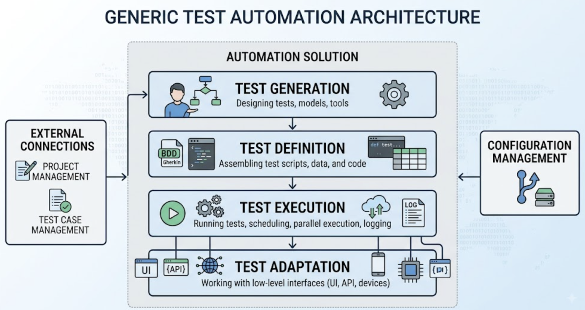
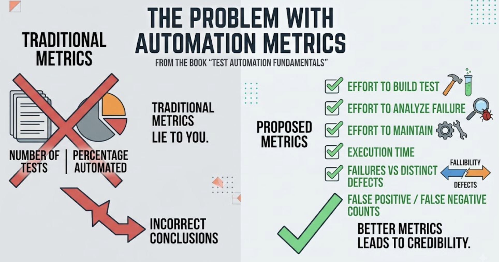

There are many books on software testing. A small subset of them are dedicated to test automation. The majority of test automation books that I've read were about specific libraries (hello, Selenium) or technology-specific tools, like JUnit or pytest. 

In the times before AI, those books were the source of new information and useful practices. If you don't wanna read official documentation or you want some insights from a dev who created a tool - grab a book, and you are ready!:)

The downside of such books is that they teach you about the trees, but you don't see the forest. You can write a script to do a login test, but you may struggle with the question: "Why is our test suite always red?" or "Why should we trust your tests?"

Additionally, in the age of AI, much of this sacred wisdom about the tools is in a matter of one prompt. (The question is only: "Would you trust the output of the machine?" But this question is worth another blog post). 

[Test Automation Fundamentals (Baumgartner, Steirer, Wendland, Gwihs, Hartner & Seidl — Rocky Nook, 2022)](https://a.co/d/05jZw2Ar) helps you build and organize fundamental knowledge of what test automation is in a nutshell. It helps to build a skeleton that you can move from project to project, from technology to technology, from tool to tool - and build fast and reliable automation. 

By the way. Test Automation Fundamentals is a companion book for those who are preparing for [ISTQB Certified Test Automation certification](https://istqb.org/certifications/certified-tester-advanced-level-test-automation-engineering-ctal-tae-v2-0/). 
Certifications are always a hot topic. You can read a book and get a vast amount of knowledge even without certification. Or - you can get it too.

Let me share five big ideas from the "Test Automation Fundamentals" book that I found interesting.

## 5 big ideas from "Test Automation Fundamentals"

### 1. Test automation project is a software product

The first core idea of the ["Test Automation Fundamentals"](https://a.co/d/05jZw2Ar) is to move your thinking from writing scripts to creating test automation solutions. A solution consists of tools, framework, test data, environments, configuration, and documentation. 

A test automation solution is a software product. So we, as test engineers, should treat it the same way.

- We need to define stakeholders for such solutions and find out their expectations. 
- We need to come up with requirements and turn them into a backlog.
- We need to put the code into version control and prepare release notes.

Many projects treat test automation as a side activity. Testers will build a reliable and robust solution in the breaks between meetings and testing of new features ... within a 2-week sprint. Such attention and approach can bring only chaos in the testing process. With automation, we can only ... automate that chaos.

### 2. Generic test automation architecture

The main outcome that ["Test Automation Fundamentals"](https://a.co/d/05jZw2Ar) brings us is the definition of the generic test automation architecture. 

In a nutshell, it consists of the four layers:
- Test generation - how we design the tests, either manually or using model-based tools
- Test definition - how we assemble the tests and data (from BDD and keyword-driven automation to the test classes directly in code)
- Test execution - how we run tests (scheduling, parallelism, setup and teardown methods, logging, benchmarking)
- Test adaptation - how we work with lower-level libraries (UI, API, devices, simulators)

Besides the core components, each automation solution may have external connections to the project and test-case management systems. We shouldn't forget about proper configuration management. 

I am really happy that the authors of the "Test Automation Fundamentals" book recommend using software engineering principles, like [SOLID](https://en.wikipedia.org/wiki/SOLID), in the test code. Because test code is not different from the feature code. It's code. So the abstraction rules are applicable in the test code too. The same goes for the dangers of over-complexity.

### 3. Four types of maintenance

It was not easy to write proper automated tests. (Now, with AI, it is a bit easier). But writing a test is not the end of the story. We need to maintain it over time - as the system under test is constantly changing. 

["Test Automation Fundamentals"](https://a.co/d/05jZw2Ar) book tells us that there are not one, but four different kinds of maintenance:

1. Adaptive - change the tests when the system has changed
2. Corrective - change the tests when your test has a bug
3. Perfective - make the tests faster, scalable, and reliable
4. Preventative - prepare your tests for upcoming changes in the system or tool migration

Why do we need to think about all these types of maintenance? Why do we need to think about maintenance at all?
The authors of the book warn us about the "adaptive maintenance trap": an architecture without proper abstraction that makes any type of refactoring a nightmare.
Test engineers spend too much time adapting the tests to a new version of the system - and less time to actually test. As a result, real bugs may slip into the releases, management gets angry, and automation becomes ... a burden and extra cost without value. 

That's why it is crucial to spend time to set up a proper test automation architecture at the start. 

P.S. Interesting, will AI coding agents be able to fight with the adaptive maintenance trap or ... will it rewrite all the tests from scratch for each new version? :)

### 4. We need to test ... the tests

We build a test automation solution to help reveal information about the quality of another system. If the automation solution is not stable and reliable, the whole team, including the testers themselves, will not have trust in such information. 

If our tests are not stable, we can have either false positives (that is a waste of time spent on analysis) or false negatives (that can be a real bug that we miss).

To deal with instability, we need to check where the problem is: in the test or the test environment. Try to isolate the non-deterministic parts and make them as reliable as possible. Remember that the more layers we test, the more sources of instability we have. That's why UI tests are much more unstable than, for example, API tests.

Another thing that we need to remember about is the degree of intrusion. The degree of intrusion is how much the act of testing changes the behavior of the system. Sometimes, in the race to perfect stability, we change the system too much, which makes such testing unrealistic. The author of "Test Automation Fundamentals" proposes the following heuristic: "the higher the test level, the lower the intrusion should be".

### 5. Automation metrics ... lie to you

["Test Automation Fundamentals"](https://a.co/d/05jZw2Ar) states that the most popular metrics, such as number of automated tests or percentage automated, tell you nothing when used in isolation. 

Instead, the authors propose the following metrics for automated tests:
- effort to build a test
- effort to analyze the failure
- effort to maintain
- execution time
- ratio of failures to distinct defects
- false-positive and false-negative counts

Speaking about the test report. I completely agree with the book that the report should make clear which inferences it does and doesn't support. The report (and testers themselves) should explain that a green regression run does not automatically mean that the release is completely bug-free. 
Such explanations, in the long run, help to build credibility for testers and testing as a discipline within the team.

## Bad parts and cautions

- The book was published in 2022 - when AI and LLMs had just started to emerge. Do not expect any notion of AI in the book
- The book may feel too academic for some readers. Because some readers want quick answers. "Test Automation Fundamentals" is about the methodology and vision.
- The book does not provide an answer to which framework, library, tool, or programming language is the best for test automation. All these things are highly subjective and context-driven

## Should you read "Test Automation Fundamentals"?

Yes, if you are a middle or senior engineer who wants to move from writing scripts to building and understanding bigger solutions and processes. The book will prepare you to lead and own automation initiatives and talk to stakeholders at higher levels.

No, if you want quick code or solutions for a particular tool. "Test Automation Fundamentals" illustrates the concepts, not exact samples. You can also always ask AI to build those samples for you. 

["Test Automation Fundamentals"](https://a.co/d/05jZw2Ar) book gives you a conceptual overview of what test automation really is and builds a common vocabulary to explain automation to other people within your organization. 

P.S. So far, it's the best "theoretical" book about test automation I found on the market. (For AI, you can find other books. For example: ["Software Testing with Generative AI"](https://testengineeringnotes.com/posts/2026-06-23-testing-with-gen-ai-review/) by Mark Winteringham)

