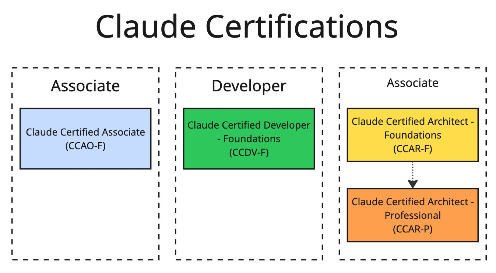
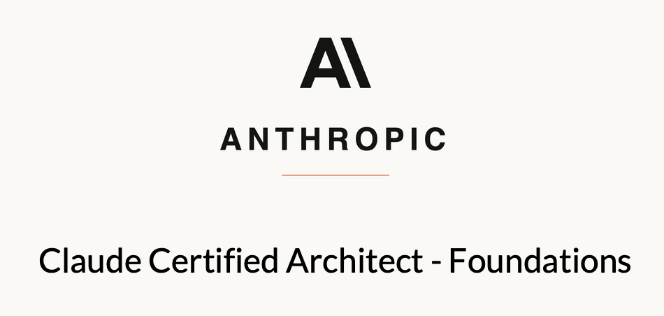

I recently earned two certifications: "Claude Certified Developer - Foundations" and "Claude Certified Architect - Foundations".

In this post, I'll cover the Anthropic certifications, how to prepare, how to pass, and whether they're worth it at all.

**❗️Availability Note - September 2026:** You can only take the certification if your company is an Anthropic partner. Individual certifications aren't available as of now.

## ✍️ Claude Certification Levels

**There are three certification tracks:** Associate, Developer, and Architect. Only Architect has two levels: Foundations and Professional.

You are not forced to get all the certificates - you can choose only one.

The exams are a multiple-choice questionse. But do not worry - in case of multiple answers, the question will state it directly.

Organization details (including prices) can be found in the following table:

| Certification | Questions | Passing score | Price |
|---|---|---|---|
| Claude Certified Associate – Foundations (CCAO-F) | 60 | 720 / 1,000 | $99 |
| Claude Certified Developer – Foundations (CCDV-F) | 53 | 720 / 1,000 | $125 |
| Claude Certified Architect – Foundations (CCAR-F) | 60 | 720 / 1,000 | $125 |
| Claude Certified Architect – Professional (CCAR-P) | 63 | 720 / 1,000 | $175 |

> Keep in mind that **every certification is valid only for 12 months**. Given how fast AI is developing right now, that makes sense :)

You can pass all exams online, via Pearson platform.

How long did preparation take me? In addition to completing the recommended courses, I spent roughly 20–30 hours on hands-on practice and mock exams. 

### Which certification to choose?

- For non-technical or business people it's worth to check the Associate level exam. 

- For engineers already working with Claude, I think Developer Foundations is worth taking. 

- Architect Foundations is more valuable if you regularly make system-level design decisions. 

- In case if you are an experienced solution architect transforming enterprise with AI - choose Architect Professional one.

## 🤓 My experience with Claude Certified Developer - Foundations (CCDV-F)

This level includes the Claude Certified Developer – Foundations certification. The exam validates that someone can build, integrate, and ship production-grade applications, agents, and workflows on the Claude platform.

Main audience: senior engineers, AI/ML engineers, technical leads who usually turn business requirements into working systems.

### Topics you can expect at the exam

| Topic | Weight |
| - | - |
| Applications and integration | 33.1% |
| Model selection and optimization | 16.8% |
| Agents and workflows | 14.7% |
| Prompt and context engineering | 11.0% |
| Tools and MCPs | 10.6% |
| Security and safety | 8.1% |
| Claude Code | 3.1% |
| Eval, testing, and debugging | 2.6% |

### How did I prepare

I started with the 5 recommended courses in the Anthropic Partner Academy. They're text-based, with knowledge checks in the form of exercises and quizzes. The information is fairly up to date, but don't expect a lot of depth. Ask Claude for more!

Then I took other Claude courses, such as "Building with Claude API" and "Claude Code in Action."

After completing the courses, I would budget another 20–30 hours for hands-on practice and mock exams. 

To practice, I put course notes into [NotebookLM](https://notebook.google.com/) and practiced with its quizzes and flashcards. Also I used [mock exam on Udemy](https://www.udemy.com/course/claude-certified-developer-foundations-ccdv-f-exams-2026) which helps to simulate exam conditions well. 

### Tips

> Tip: Join the exam 30 minutes early - you need to have time to register and get access to the exam in the Pearson system.

> Tip: Some questions may require general engineering knowledge (e.g., what is SDLC or non-functional requirements).

> Tip: Start with striking through obviously wrong options - it will help you to concentrate on the remaming options. 

> Tips: It's worth spending time to write some Python code using an official SDK. Compare synchronous, async and batch APIs.

## 😎 My experience with Claude Certified Architect - Foundations (CCAR-F)

This level includes the Claude Certified Architect – Foundations. The exam is for those who design and implement production applications with Claude. 

### Topics you can expect at the exam

| Topic | Weight |
| - | - |
| Agentic architecture and orchestration | 27% |
| Claude Code configuration and workflows | 20% |
| Prompt engineering and structured output | 20% |
| Tool design and MCP integration | 18% |
| Context management and reliability | 15% |

### How did I prepare

At first, I completed the recommended courses. Most of them are free and [come from the list I mentioned in the previous post.](https://testengineeringnotes.com/posts/2026-09-15-claude-courses/) The new ones cover using Claude with Amazon and Google Cloud, but they overlap a lot with "Building with Claude API."

Next step I took was reading the [text materials](https://claudecertificationguide.com/learn) and [watching them on YouTube](https://www.youtube.com/playlist?list=PLFz7SvAnfqLpjPCPJBkUy077BC5ecuE8c).

For the practice, I also used course notes with [NotebookLM](https://notebook.google.com/) and practiced with its quizzes and flashcards.

For the mock exams, both [bank of questions by Matthew Hartman on Udemy](https://www.udemy.com/course/claude-certified-architect-foundations-ccar-f-exams-2026) and [free mock exam](https://claudecertificationguide.com/mock-exam/start) worked very well.

### Tips

> Tip: The main theme of the exam is trade-offs. You need to be able to understand the scenario and context, find possible options, analyze and compare variants, and select the most appropriate solution. 

> Tip: Do one pass with all questions till the end and then use "Review" function to go through questions once again. 

> Tip: For the exam, it's better to choose the option the will help in short or mid-term, not in a long-term. But it depends on the question.

## Other Certifications

### 😀 Claude Certified Associate (CCAO-F)

Associate-level certification is for non-technical professionals who regularly use Claude at work. The key thing is that no coding or API experience is needed. 

Topics you can expect at the exam:

| Topic | Weight |
| - | - |
| Output evaluation and validation | 21% |
| Workflow integration and solution design | 16% |
| Governance, risk, and responsible use | 15% |
| Prompting and task execution | 14% |
| Product and model selection | 12% |
| Configuration and knowledge management | 12% |
| Troubleshooting and optimization | 10% |

### 😎 Claude Certified Architect - Professional (CCAR-P)

This certification is for people who are constantly architecting and assessing solutions for multiple clients and contexts. According to the exam guide, this certification is recommended for architects with 3+ years of hands-on experience. 

Topics you can expect at the exam:

| Topic | Weight |
| - | - |
| Integration | 19% |
| Solution design and architecture | 17% |
| Evaluation, testing, and optimization | 16% |
| Governance, safety, and risk management | 14% |
| Stakeholder communication and lifecycle management | 14% |
| Claude models, prompting, and context engineering | 13% |
| Developer productivity and operational enablement | 7% |

## Are Claude certifications worth it?

Preparation for the developer and architect exams gave me a solid body of knowledge. It gave me a structured map of topics to explore further. More importantly - the preparation left me with practical ideas on how to apply the knowledge at work and use skills, MCPs, agents, and Claude Code more efficiently rather than occasional prompting.

But do not expect that exams will turn you into a mature modern AI Engineer in one day. Certificates and courses will give you a lot of materials. Some materials have general-purpose applicability. But most of the knowledge is more or less tied to Claude and the infrastructure around it. 

In today's job market, certifications like these can help you get interview invitations and prove that you have the knowledge. Yes, these exams don't guarantee skills or depth. But without them, you might not even get an interview at some companies. C'est la vie!

**Would I recommend certifications?** Yes - if you already use Claude professionally. The badge itself is ok, but the bigger value for me was the structured preparation: it exposed gaps in my knowledge and gave me practical ideas I could apply at work.

